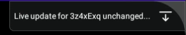
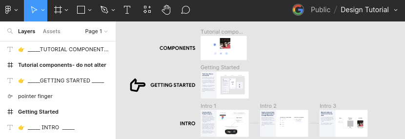
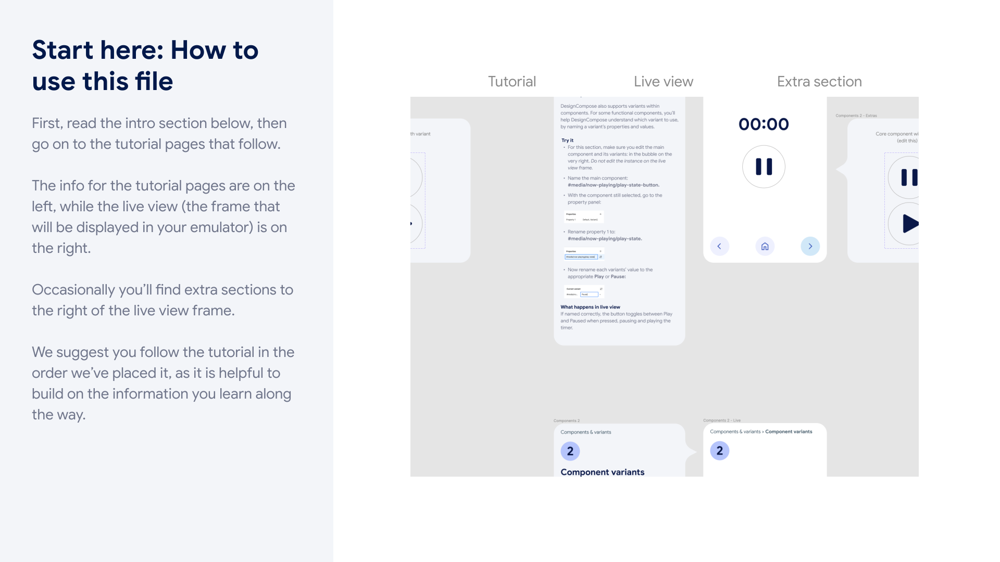

# Automotive Design for Compose

- [Automotive Design for Compose](#automotive-design-for-compose)
  - [Introduction](#introduction)
  - [Getting Started](#getting-started)
  - [Building your own app](#building-your-own-app)
- [Working with the Source](#working-with-the-source)
  - [SDK build dependencies](#sdk-build-dependencies)
    - [Android Studio](#android-studio)
    - [Android NDK](#android-ndk)
    - [Rust](#rust)
    - [Rust Toolchains](#rust-toolchains)
  - [Source Layout](#source-layout)
  - [Building additional resources](#building-additional-resources)
    - [Building the Automotive Design for Compose Figma Plugin and Widget](#building-the-automotive-design-for-compose-figma-plugin-and-widget)
  - [Get in touch](#get-in-touch)

[](https://api.securityscorecards.dev/projects/github.com/google/automotive-design-compose)

## Introduction

Automotive Design for Compose (also called DesignCompose in the source) is an extension to [Jetpack Compose](https://developer.android.com/jetpack/compose) that allows every screen, component, and overlay of your Android App to be defined in [Figma](https://www.figma.com), and lets you see the latest changes to your Figma design in your app, immediately!

To use Automotive Design for Compose in an app, a developer specifies the Composables that they’d like to be defined by Figma, and a designer uses Figma to draw them. Most Figma features, including Auto Layout, Interactions, Variants, and Blend Modes are fully supported. This repo includes the DesignCompose library, an interactive tutorial app (in reference-apps/Tutorial), and a sample customizable Media Center for Android Automotive OS (in reference-apps/aaos-unbundled).

Find our documentation on the
[Android Automotive partner website](https://docs.partner.android.com/automotive/customize/designcompose).

## Getting Started

The DesignCompose Tutorial app shows you the capabilities of DesignCompose through a series of interactive examples.  You will need a Figma account and [personal access token](https://help.figma.com/hc/en-us/articles/8085703771159-Manage-personal-access-tokens) to view the Tutorial Figma file and a large-screen device to run it on.

You'll work with your own copy of the [Tutorial Figma file](https://www.figma.com/community/file/1228110686419863535/Tutorial-for-Automotive-Design-for-Compose). Create your own by clicking **Open in Figma**, which creates a copy of the file in your account. Once open, identify the Figma Document ID from your new file's URL. It's the alphanumeric string between `file/` and the name of the document. For example:

<pre><code>figma.com/file/<b>ABCDEFG123</b>/File-name</code></pre>

The app's Gradle project is located in `reference-apps/tutorial`. Build and launch it on your device, then set your Figma Access Token on the app by running:

```shell
FIGMA_ACCESS_TOKEN=<YOUR_ACCESS_TOKEN> \
    ./gradlew setFigmaTokenDebug
```

Next, switch the app to use your copy of the Tutorial file by clicking the dropdown arrow in the upper right. This will open the Design Switcher.



Click the **Change** button to switch document IDs, and enter the ID of your copy of the Tutorial Figma File. Click **Load** and the app will start fetching your file (it'll take about a minute)

While that's loading, open your copy of the Tutorial file on Figma and find the **Getting Started** box (it's at the top with a pointer pointing to it).



Zoom in on it and begin your tutorial!



## Building your own app

We'll be adding more documentation and guides soon! For now you can look to `reference-apps/helloworld` for an an example of a basic app.

# Working with the Source

## Testing presubmits locally

To check that you can pass presubmits and nightlies before pushing to PR you can do the following:

- Prerequisites:
  - Make sure your system can run Android AVDs
  - Have the build dependencies below installed
  - Check out the current supported branch of the AAOS Unbundled repo (see the "Check out the Unbundled AAOS Repo" job in `.github/workflows/main` for the correct branch) and set $ORG_GRADLE_PROJECT_unbundledAAOSDir to the path of the checkout
- Run the following scripts in order:

  ```shell
  ./dev-scripts/clean-all.sh #Optional, but will ensure you're testing a clean environment.
  ./dev-scripts/format-all.sh
  ./dev-scripts/test-all.sh
  ```

## SDK build dependencies

DesignCompose's Live Update system uses a native library built in Rust to fetch and serialize your Figma Documents. You'll need the following to build it and the rest of the SDK.

### Android Studio

Currently testing with Android Studio Flamingo | 2022.2.1

### Android NDK

Version `25.2.9519653` is required. It can be installed via [Android Studio's SDK Manager](https://developer.android.com/studio/projects/install-ndk#specific-version) or on the command line using the `sdkmanager` binary.

```shell
"${ANDROID_HOME}/cmdline-tools/latest/bin/sdkmanager" --install "ndk;25.2.9519653"
```

### Rust

Rust 1.68.0 is required to compile DesignCompose's Live Update service. Install at [rustup.rs](https://rustup.rs/). For working with the code, we recommend the `rust-analyzer` plugins for VS Code and Android Studio / IntelliJ.

Android Studio will not pick up on a new Rust install without restarting the IDE. In addition, if you launch Android Studio via desktop shortcut or similar (i.e. not from the command line), then it still may not detect the install. In this case you can log out of your computer and back in, or simply restart your computer.

### Rust Toolchains

The DesignCompose library includes a Rust JNI library, which requires Rust build target toolchains. Install them by running the following from the root of the repository

```shell
./install-rust-toolchains.sh
```

## Source Layout

Automotive Design for Compose consists of several components:

- The Jetpack Compose renderer of Automotive Design for Compose documents consists of several modules:

  - `annotation` contains the Kotlin annotation definitions like `@DesignDoc` and `@DesignComponent`.

  - `codegen` contains the Kotlin compiler plugin that processes the annotations and generates stub Composables that use the Automotive Design for Compose runtime.

  - `designcompose` contains the code that interprets Automotive Design for Compose documents and renders them using Jetpack Compose. It also contains the code that uses the Figma Import JNI library to fetch documents from the Figma webservice.

- Figma Import, in `crates/figma_import`, is a library implemented in Rust that fetches documents and resources from the Figma API and generates a serialized document containing only the information that Automotive Design for Compose needs. The JNI interface used by the Android runtime is in `crates/live_update`.

- Figma plugins that give designers more control and a better experience using Figma with Automotive Design for Compose:

  - The Extended Layout Plugin, in `support-figma/extended-layout-plugin` , provides a panel for formatting text, a panel to provide a JSON file with keyword details, a panel to validate keyword usages against the provided JSON file, and a command to sync Figma's prototype settings to the main document.

  - Auto Content Preview Widget, in `support-figma/auto-content-preview-widget` provides a Figma widget that uses the JSON file and allows designers to create and preview complex list layouts.

- A Validation app in `integration-tests/validation` is used for visually validating changes

- The Tutorial app in `reference-apps/tutorial` provides an overview of DesignCompose

- The `reference-apps/aaos-unbundled` directory contains a separate Gradle project that includes demonstrations of DesignCompose with Android Automotive OS Apps, such as a MediaCenter app.

## Building additional resources

### Building the Automotive Design for Compose Figma Plugin and Widget

The DesignCompose Plugin and Auto Content Preview widget are needed to enable additional layout options and features. The latest releases are available in the Figma Community and on our [Figma Community profile](https://www.figma.com/@designcompose). To build and install an older or customized version, follow these instructions:

You can build on any system, but Figma only supports plugin installation via the [Figma Desktop App](https://www.figma.com/downloads/), which only runs on macOS and Windows.

There are two packages that are needed, the Extended Layout plugin and Auto Content Preview widget. Both are located in the `support-figma` directory. Build each by running the following: (you'll need `nodejs` and `npm` installed on your system)

```shell
npm install
npm run build
```

Then open the Figma Desktop app, go to **Plugins** -> **Development** -> **Import plugin from Manifest** and select the `manifest.json` file to import.

## Get in touch

- Report a bug: <https://github.com/google/automotive-design-compose/issues>
- Say hello:
    [aae-design-compose@google.com](mailto:aae-design-compose@google.com)
