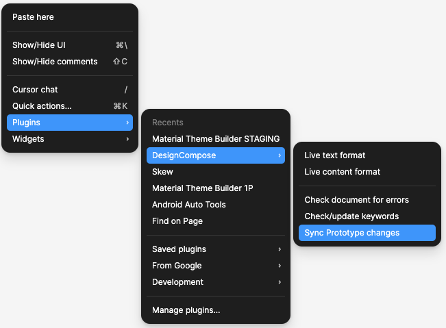

# Animations

Animations are supported in two different ways: animations from Figma interactions, and animations from programmatically changing variants. To enable animations, the squoosh rendering path must be enabled by turning it on and wrapping your `@Composable` content with it:
```kotlin
    CompositionLocalProvider(LocalDesignDocSettings provides DesignDocSettings(useSquoosh = true)) {
        content()
    }
```

## Figma interaction animations
Animations set in Figma as a prototype interaction are supported. These animations run automatically whenever an interaction triggers the animation to begin. After making any changes to an interaction, make sure to run the `Sync Prototype changes` plugin so that the interaction is saved to the plugin data.



## Variant change animations
When variants change programmatically using the `@DesignVariant` customization, they will use a default spring animation for the transition. This can be customized using the custom animation API by specifying an easing type and duration in the `DesignDocSetting()` function that enables the squoosh animation code path. Populate the new `customVariantTransition` parameter with a function that takes a `VariantTransitionContext` and returns an `AnimationTransition` interface. The context provides some data on variant that is changing, and the `AnimationTransition` needs a function `animationSpec()` that returns `AnimationSpec<Float>`. The `SmartAnimationTransition` is the only supported transition at this time. The easiest way to use this is to use a compose function such as `androidx.compose.animation.core.tween`.

Here is an example:

```kotlin
DesignDocSettings(
    useSquoosh = true,
    customVariantTransition = { context ->
        if (context.fromComponentSet("MyComponentName")) {
            SmartAnimateTransition(
                tween(
                    durationMillis = (2f * 1000.0).roundToInt(),
                    easing = CubicBezierEasing(0.37f, 0f, 0.63f, 1f)
                )
            )
        } else {
            val mass = 1.0f
            val stiffness = 20.0f
            val critical = sqrt(4.0f * stiffness * mass)
            val damping = 30.0f
            SmartAnimateTransition(
                spring(dampingRatio = damping / critical, stiffness = stiffness)
            )
        }   

    }
)
```
<div class="warning" style='padding:0.1em; background-color:#FFF0B2; color:#000000; border:1px solid black; box-shadow: 5px 6px grey;'>
<span>
<p style='margin-left:1em;'>
We’re still working on the best way to identify the elements that are being animated. We added functions in <b>VariantTransitionContext</b> that use the node or component name, but this may change in the future.
</p>
</span>
</div>