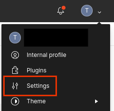
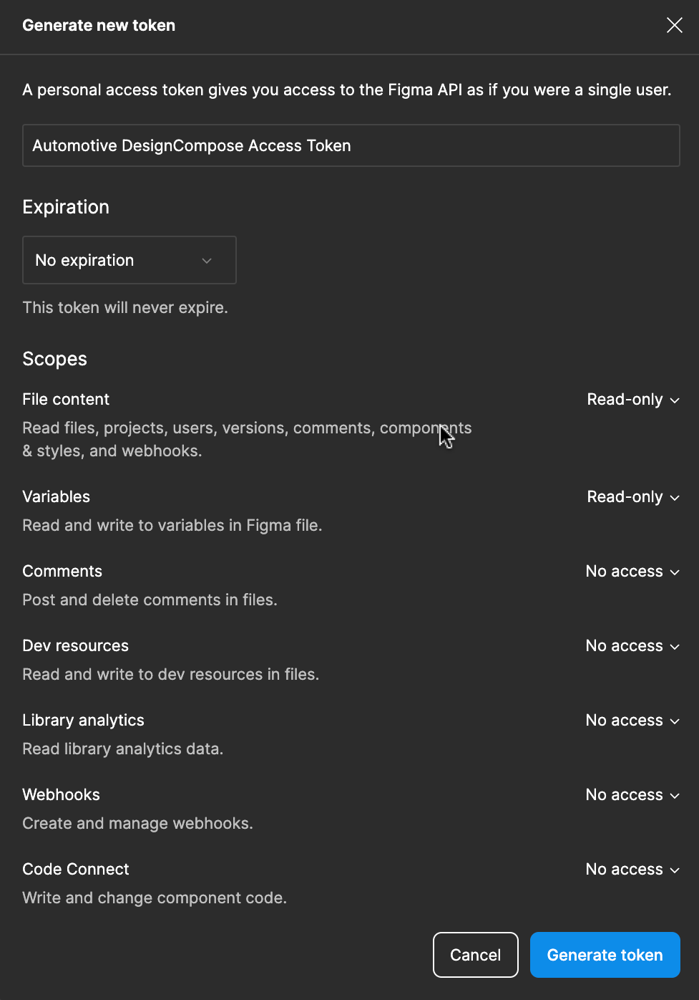



# Set Up Figma Authentication

This guide walks you through the process of authenticating DesignCompose-enabled
apps with Figma.

## Generate a Figma access token for your Figma account {#GetFigmaToken}

To configure access to your documents, you need to generate an access token.

1.  From any page on [figma.com][1]{:.external}, click the drop-down in the
    upper right corner and select **Settings**.

    

    **Figure 1.** Figma Settings Menu.

1.  Scroll down to **Personal access tokens** and click **Generate new token**

1.  Automotive Design for Compose requires a token with read-only File content access. All other scopes can be left set to "No access". Set the permissions appropriately, enter a name for the token and set the expiration, then click **Generate token**

    

1.  Record the new **Figma Access Token** token. This token is used in the next
    section.

To learn more about personal access tokens, see [Manage personal access
tokens][2]{:.external} in the Figma help center.

### Store your Figma access token {#StoreFigmaToken}

The token grants full access to the contents of your Figma files, so don't
commit the token into source control. You can store the token by writing it to a
file on your local machine, such as `.figma_token.env`.

Create the file by running:

```shell
echo FIGMA_ACCESS_TOKEN=<YOUR_ACCESS_TOKEN> > .figma_token.env
```

To load the key into the variable, run the following:

```shell
export $(cat .figma_token.env)
```

You can add the previous line to your `.bashrc` file to automatically set the
variable when you log in.

## Set your Figma access token in an app {#SetUpFigmaToken}

The Figma access token is set by using the Android Debug Bridge (adb) to send it
to the running app. A Gradle task is provided to simplify this, or the adb
method can be used for greater control.

### With a Gradle task {#FigmaTokenWithGradle}

The DesignCompose Gradle plugin adds the `SetFigmaToken` tasks to the Gradle build. Individual tasks are generated for each 
build variant, such as `Debug` and `Release`. Configure your Figma token to the
environment variable `$FIGMA_ACCESS_TOKEN` and call the instance of the task for
whichever app you're working with. For example:

```shell
cd reference-apps/tutorial
FIGMA_ACCESS_TOKEN=XXXXXX-XXXXXXXXXX-XXXX ./gradlew setFigmaTokenDebug
```

The task uses adb to check whether the app is installed and skip execution if it
isn't. This lets you run `./gradlew setFigmaToken<variant>` from the root of the project
to configure all installed apps.

The task uses adb, which automatically selects your device if it only detects
one. If you have multiple emulators or devices connected, set the address of the
device you want (for example `emulator-5444`) in the `$ANDROID_SERIAL`
environment variable. You can run adb devices to see the list of devices and
their addresses.

### With Android Debug Bridge {#FigmaTokenWithAdb}

Set the Figma token using adb to send an [explicit intent][3] directed to the
app. The intent action is `setApiKey`, and it requires extra string data with
key `ApiKey` and value `<your Figma Token>`. Both the app's main activity and a
service that is included in DesignCompose can receive the intent. To start the
service, run:

```shell
adb shell am startservice -n "<YOUR_APP_ID>/com.android.designcompose.ApiKeyService" -a setApiKey -e ApiKey $FIGMA_ACCESS_TOKEN
```

Example for the tutorial app:

```shell
adb shell am startservice -n "com.android.designcompose.tutorial/com.android.designcompose.ApiKeyService" -a setApiKey -e ApiKey $FIGMA_ACCESS_TOKEN
```

[1]: https://www.figma.com
[2]: https://help.figma.com/hc/en-us/articles/8085703771159-Manage-personal-access-tokens
[3]: https://developer.android.com/guide/components/intents-filters#Types
