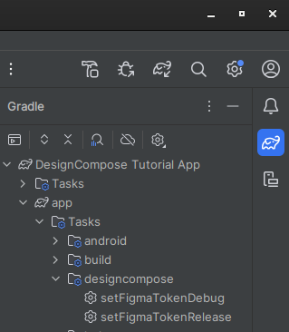



# Set Up Figma Authentication

This guide walks you through the process of authenticating DesignCompose-enabled
apps with Figma.

## Generate a Figma access token for your Figma account {#GetFigmaToken}

To configure access to your documents, you need to generate an access token.

1. From any page on [figma.com][1]{:.external}, click the drop-down in the
    upper right corner and select **Settings**.

    

    **Figure 1.** Figma Settings Menu.

2. Scroll down to **Personal access tokens** and click **Generate new token**

3. Automotive Design for Compose requires a token with read-only access for File content, metadata, versions, read-only access for Variables if available, and read-only access for library_assets, library_content and team_library_content. All other scopes can be left unchecked. Set the permissions appropriately, enter a name for the token and set the expiration, then click **Generate token**
    * Note: variable access is only available under the Figma Enterprise plan. If variable access
    is not available, developers can still get most of the DesignCompose functionality other than
    features related to variables. See [Variables][2] page for more details.

    

4. Save the token in the following well-known location on your file system. The location depends on your operating system:

    * Linux, MacOS: `$HOME/.config/figma_access_token`

    * Windows: `%APPDATA%\figma_access_token`

To learn more about personal access tokens, see [Manage personal access
tokens][3]{:.external} in the Figma help center.

## Set your Figma access token in an app {#SetUpFigmaToken}

The Figma access token is set by using the Android Debug Bridge (adb) to send it
to the running app. A Gradle task is provided to simplify this, or the adb
method can be used for greater control.

### With a Gradle task {#FigmaTokenWithGradle}

The DesignCompose Gradle plugin adds the `SetFigmaToken` tasks to the Gradle build. Individual tasks are generated for each
build variant, such as `Debug` and `Release`. The tasks can be found in the `designcompose` menu in the Gradle panel of Android Studio.



The tasks can also be triggered from the command line:

```shell
cd reference-apps/tutorial
./gradlew setFigmaTokenDebug
```

The task uses adb to check whether the app is installed and skip execution if it
isn't. This lets you run `./gradlew setFigmaToken<variant>` from the root of the project
to configure all installed apps.

The task uses adb, which automatically selects your device if it only detects
one. If you have multiple emulators or devices connected, set the address of the
device you want (for example `emulator-5444`) in the `$ANDROID_SERIAL`
environment variable. You can run adb devices to see the list of devices and
their addresses.

### With Android Debug Bridge {#FigmaTokenWithAdb}

Set the Figma token using adb to send an [explicit intent][4] directed to the
app. The intent action is `setApiKey`, and it requires extra string data with
key `ApiKey` and value `<your Figma Token>`. Both the app's main activity and a
service that is included in DesignCompose can receive the intent. To start the
service, run:

```shell
adb shell am startservice -n "<YOUR_APP_ID>/com.android.designcompose.ApiKeyService" -a setApiKey -e ApiKey $FIGMA_ACCESS_TOKEN
```

Example for the tutorial app:

```shell
adb shell am startservice -n "com.android.designcompose.tutorial/com.android.designcompose.ApiKeyService" -a setApiKey -e ApiKey $FIGMA_ACCESS_TOKEN
```

[1]: https://www.figma.com
[2]: 
[3]: <https://help.figma.com/hc/en-us/articles/8085703771159-Manage-personal-access-tokens>
[4]: <https://developer.android.com/guide/components/intents-filters#Types>
