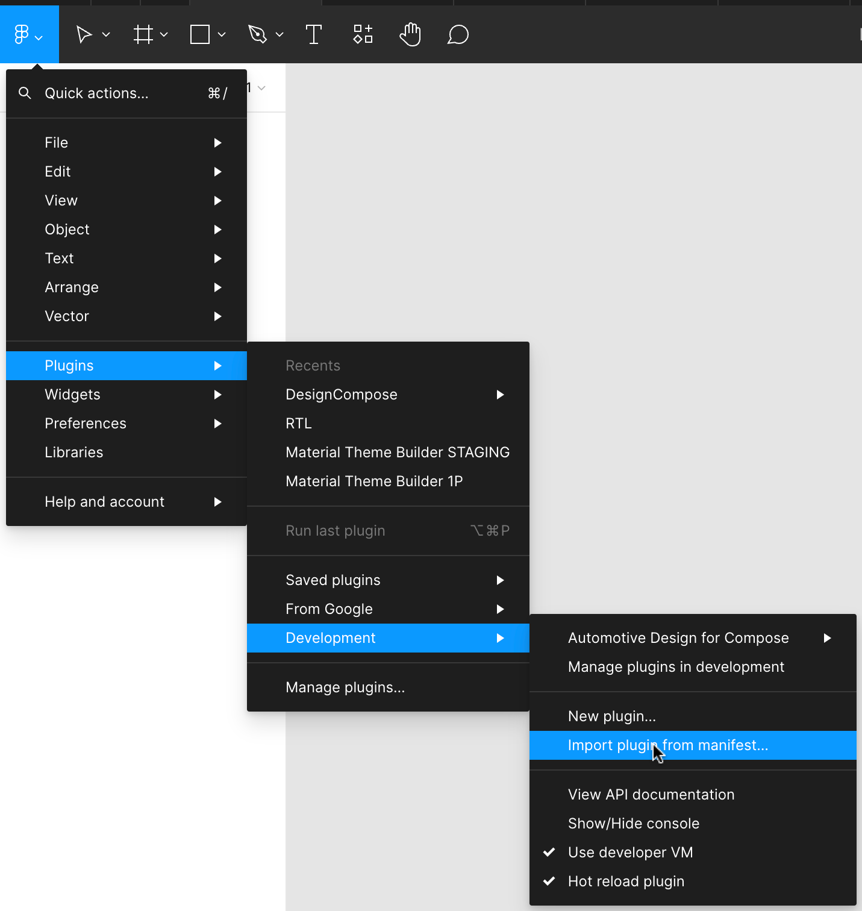
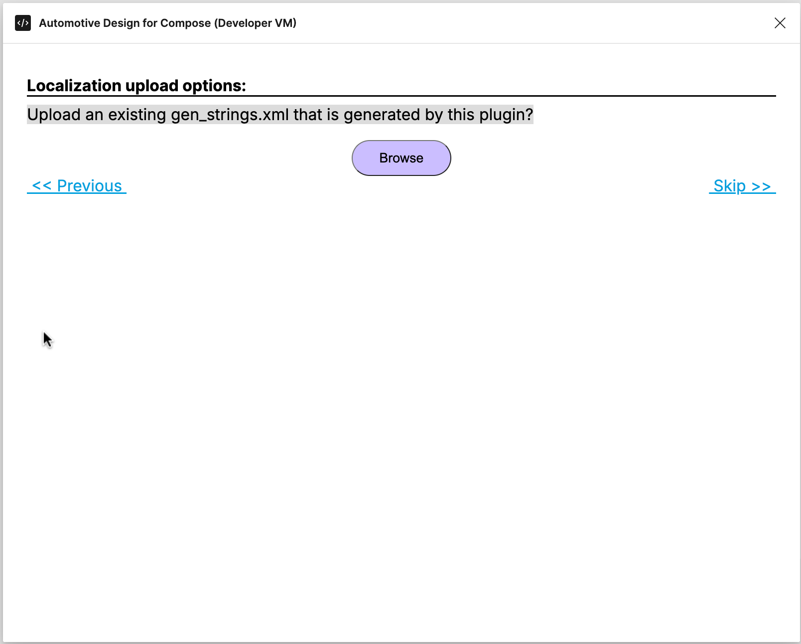
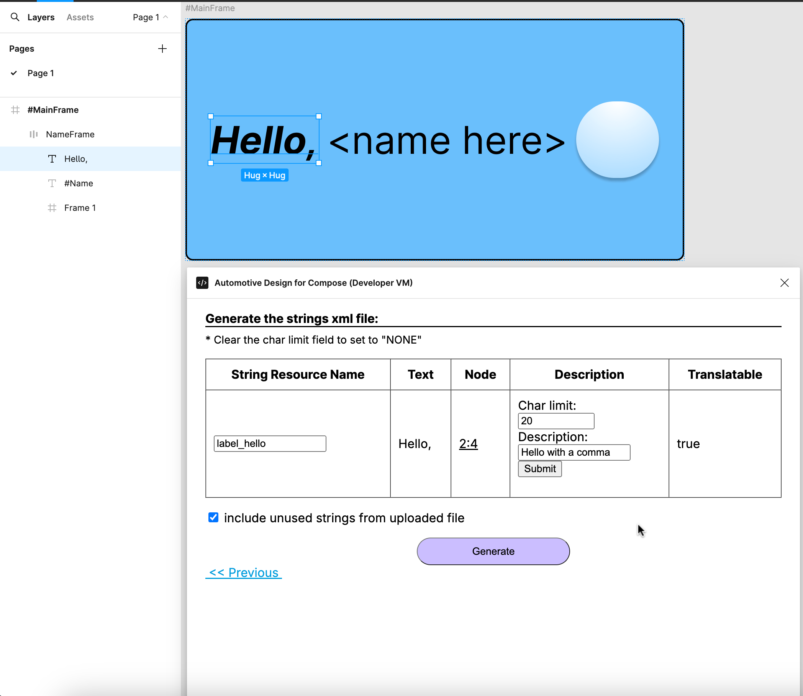
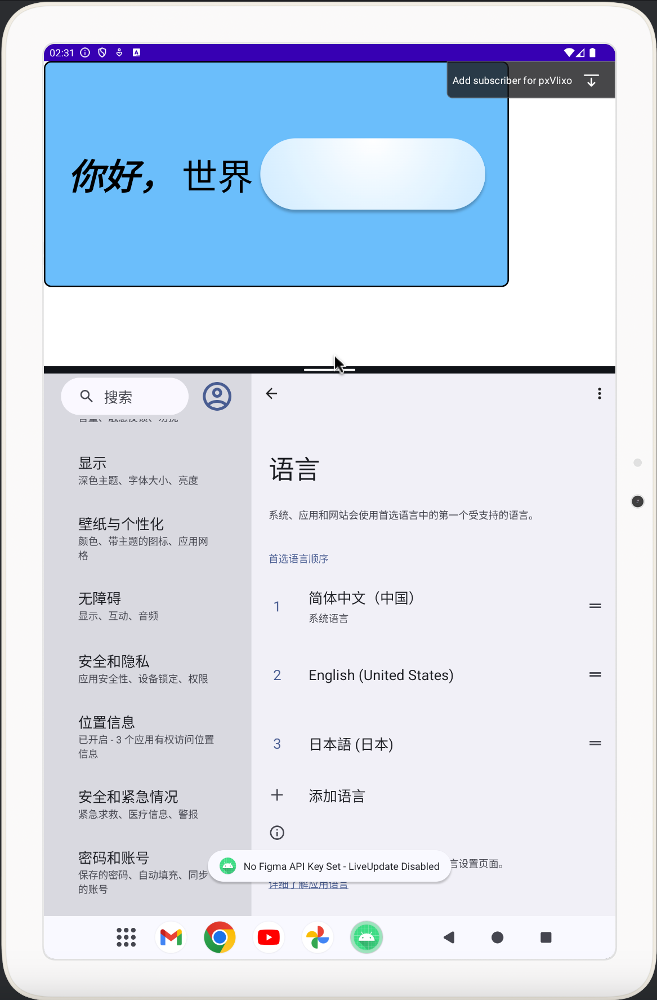

# Localization

We are developing tools for developers to localize the figma design into different languages more easily.
The first introduced tool is a figma plugin that generates a strings xml file containing the strings
used by the figma design.

## 1. Run the localization plugin

We have published our first version of the localization plugin. You can run it through:
**Figma Main Menu -> Plugins -> From Google**
   **-> Automotive Design For Compose -> Localization Tool -> Generate String Resource**

### 1.1 [Optional] Build the localization plugin from source code

Instead of running the published version of the plugin, you can also build the plugin from source
code if you would like to try unreleased features or make experimental changes on your own. Follow the
[Get Started][1] page to download the source code.

Below are the steps to build the plugin. You can also find instructions at: <https://www.figma.com/plugin-docs/>

1. Download Node.js which comes with NPM. This will allow you to install TypeScript and other libraries.
You can find the download link here: <https://nodejs.org/en/download/>.
Or you can install on linux with the command:

    ```shell
    sudo apt-get install nodejs npm git
    ```

2. Run the following to build the plugin:

    ```shell
    npm install
    npm run build
    ```

3. Install the figma desktop app. Figma will need to read the plugin code saved as a local file. You
can download it from the [Figma downloads page][2].

4. Import the plugin from manifest and you are ready to run the plugin. The file path is:

    ```text
    automotive-design-compose/support-figma/extended-layout-plugin/manifest.json
    ```

    

5. Run the plugin under development through:
**Figma Main Menu -> Plugins -> Development**
   **-> Automotive Design For Compose -> Localization Tool -> Generate String Resource**

### 1.2 Strings generation options

Currently the plugin provides two options to exclude text nodes from translations.


The first option excludes text nodes whose name starts with `#` which is a naming convention for text
nodes designed for app customization.

To use the second option, you will need to run the **Check/update keywords** plugin first to upload
the generated json file under your android app's build folder. The generated json file contains app
customizations for nodes so the localization plugin can exclude those text nodes from translation.


### 1.3 Upload a strings xml file

Click "Next" and in the second step, you can upload an existing gen_strings.xml that was generated
by this plugin before. By doing so, it allows you to merge string resources from multiple design files.

For apps using a single design file, you can always skip this step.



### 1.4 Review, update and generate the strings xml file

In the third step, the plugin generates a string resource table for you to review and update.



In the above example for [figma design Hello World][3], the output excludes the node `#Name` and only
contains the node `Hello,` with id `2:4`. The plugin auto assigns the string resource name `label_hello`
to the node `Hello,` which you can rename in this step.

The plugin also allows you to set a proper description and char limit for translations.

Finally, click on the **Generate** button and save the gen_strings.xml to the app's `res/values/` folder.


## 2. Integrate with the app

### 2.1 Review generated strings xml file

Now open Android Studio and let's start integrating the generated string xml file.


The gen_strings.xml contains a string resource entry `label_hello`. If there are any conflicts with
string resources from other strings xml files, we recommend two options to resolve the conflicts:

1. Manually resolve the conflicts by renaming or removing the conflicted string resources in other
strings xml files.

2. Run the plugin and upload other string xml file containing conflicts to merge string resources
with the figma design file to avoid conflicts.

Next the strings can be sent for translations.

### 2.2 Update dcf file

Update the dcf file used by your app so it can look up the string resource when rendering.

### 2.3 Live update option

If you use live update, because DesignCompose uses the local string from the resource file, you will
not be able to see the changes you are making to the text nodes in live update. We have provided an option
to re-enable the live update for text nodes by unchecking the `Use local string resource if exists` option.


### 2.4 Localize app side customizations

Update text customizations from hardcoded string to `stringResource`.

For customization:

```kotlin
@DesignDoc(id = helloWorldDocId)
interface HelloWorld {
    @DesignComponent(node = "#MainFrame") fun mainFrame(@Design(node = "#Name") name: String)
}
```

Update from:

```kotlin
HelloWorldDoc.mainFrame(name = "World!")
```

To:

```kotlin
HelloWorldDoc.mainFrame(name = stringResource(id = R.string.label_world))
```

with string resource

```xml
    <string name="label_world" translatable="true">world</string>
```

### 2.5 Test the localization

Assuming you have the translations for the strings ready and integrated as following:


now the app should use the translations when you change your device's locale.


## 3. How the localization works behind the plugin

### 3.1 It uses plugin data

The localization plugin goes through all the text nodes of the figma design file and auto generates
a string resource name for each text node. The string resource name is saved to the shared plugin data.
When DesignCompose fetches the figma design file, it fetches the shared plugin data and later on the
string resource name will be used to look up the local string resource to render the text node.

Char limit and description are saved to private plugin data which will only be used to regenerate the
strings xml file and will not be fetched by DesignCompose.

The plugin also provides a **Clear String Resource** tool to clear the string resource names, char
limits and descriptions from the plugin data.

### 3.2 It supports mixed styles

For a text node with a single style, the plugin generates a string resource. And for a text node with
mixed styles, the plugin generates a string array resource with each item mapping to the text segments
with different styles.

## 4. What is next

We are working on a few improvements for the plugin:

1. The ability to exclude a text node manually before hitting the **Generate** button. Designers might
add some text nodes as comments or explanations to design components which are not actually part of
the product design.
2. The ability to do different translations for the same text. Right now the plugin groups the text nodes
with the same text to use the same string resource name. However, the same text can have different
translations under different contexts.

## 5. Summary

This plugin does not perfectly solve all localization issues, but we will continue to improve it to
make localization easier for DesignCompose developers. Any suggestions or feedback are welcome!

[1]: 
[2]: <https://www.figma.com/downloads/>
[3]: <https://www.figma.com/design/hfU5fabDGmayX3zCGaIhHy>
