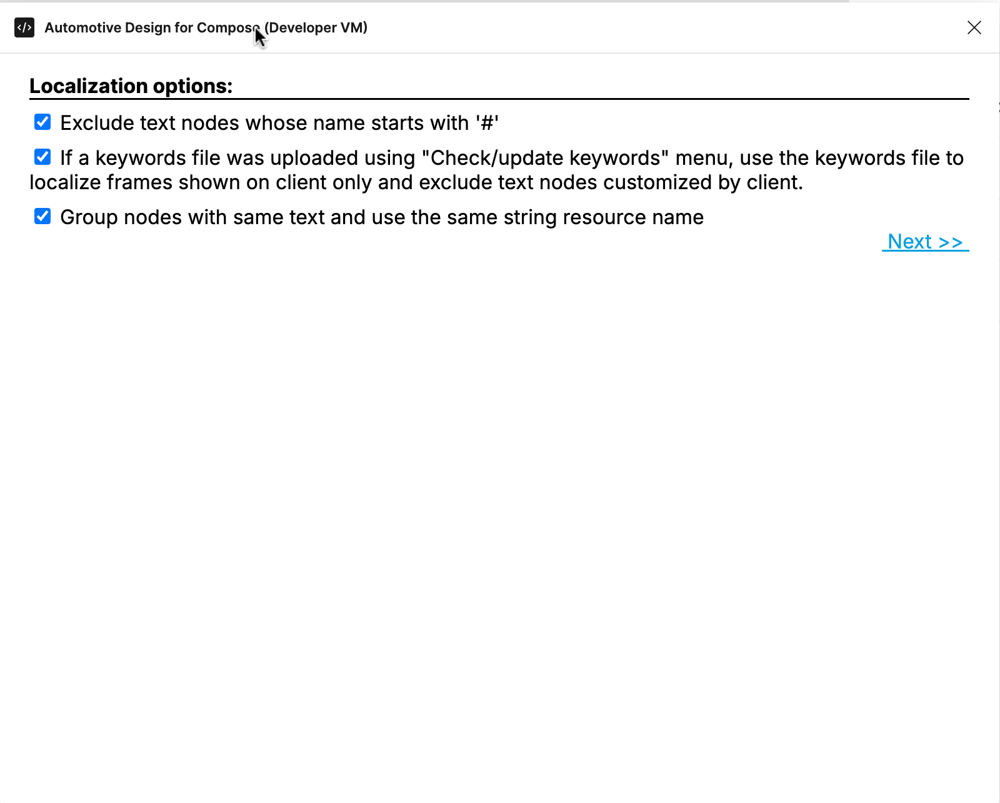
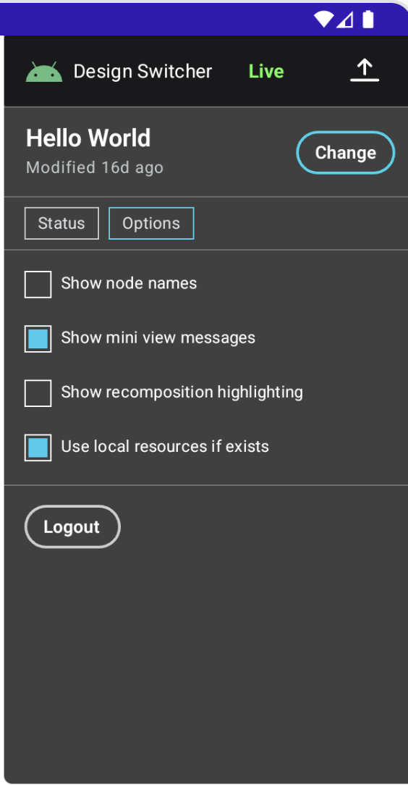

# Localization

We are developing tools for developers to localize the figma design into different languages more easily.

The first introduced tool is a figma plugin that generates a strings xml file containing the strings
used by the figma design.

The second tool is a figma plugin that iterates through all the images, then lets a user assign a
proper name and download selected images as a `drawable.zip` file.

## 1. Run the localization plugin

Both tools are now published publicly as part of the figma plugin [Automotive Design For Compose][1].
You can run it through:
**Context Menu(via right click) -> Plugins -> From Google-> Automotive Design For Compose -> Localization Tool**


### 1.1 [Optional] Build the localization plugin from source code

Instead of running the published version of the plugin, you can also build the plugin from source
code if you would like to try unreleased features or make experimental changes on your own. Follow the
[Get Started][2] page to download the source code.

Below are the steps to build the plugin. You can also find instructions at: <https://www.figma.com/plugin-docs/>

1. Download Node.js which comes with NPM. This will allow you to install TypeScript and other libraries.
   You can find the download link here: <https://nodejs.org/en/download/>. Or you can install on linux
   with the command:

   ```shell
   sudo apt-get install nodejs npm git
   ```

2. Run the following to build the plugin:

   ```shell
   npm install
   npm run build
   ```

3. Install the figma desktop app. Figma will need to read the plugin code saved as a local file. You
   can download it from the [Figma downloads page][3].

4. Import the plugin from manifest and you are ready to run the plugin. The file path is:

   ```text
   automotive-design-compose/support-figma/extended-layout-plugin/manifest.json
   ```

   

5. Run the plugin under development through:
   **Figma Main Menu -> Plugins -> Development -> Automotive Design For Compose -> Localization Tool**

## 2. String resource tool

### 2.1 Generate string resources

#### 2.1.1 Strings generation options

Currently the plugin provides three options to exclude text nodes from translations.



The first option excludes text nodes whose name starts with `#` which is a naming convention for text
nodes designed for app customization.

To use the second option, you will need to run the **Check/update keywords** plugin first to upload
the generated json file under your android app's build folder. The keywords json file contains app
customizations for nodes so the localization plugin can exclude those text nodes from translation.
It also uses the top level component names from the keywords file to locate frames that will be rendered
on the client side and will only pull strings from the text nodes in those frames. By using the keywords
file, it will exclude text nodes that are used as comments, for example.


The third option, checked by default, will generate one entry in the generated strings xml file for each
identical string. By unchecking it, it will generate one entry for each string instance no matter if
it is the same with some of the other text nodes. Later on, you can review and manually merge the same
strings if you believe they have the same meaning.

#### 2.1.2 Upload a strings xml file

Click "Next" and in the second step, you can upload an existing gen_strings.xml that was generated
by this plugin before. By doing so, it allows you to merge string resources from multiple design files.

For apps using a single design file, you can always skip this step.


#### 2.1.3 Review, update and generate the strings xml file

In the third step, the plugin generates a string resource table for you to review and update.


In the above example for [figma design Hello World][4], the output excludes the node `#Name` and only
contains the node `Hello,` with id `2:4`. The plugin auto assigns the string resource name `label_hello`
to the node `Hello,` which you can rename in this step.

The plugin also allows you to set a proper description and char limit for translations.

##### 2.1.3.1 Break identical strings into different translations

Below is an example of the output strings with the group option checked.


The strings grouping several text nodes will have a break icon button for each node. By clicking
this icon, a separate entry for that node will be created with a different string resource id. The
string resource id is auto generated by the plugin, but you can rename it. Note, if you rename it
to an exising string resource name with the same text, it will merge them together.


When it comes to the output with the group option unchecked, you can merge them by renaming them to
use the same string resource name too.

##### 2.1.3.2 Manually exclude a node from using the string resources

As you can see from the above output examples, each node id has a checkbox in front of it. By unchecking
the checkbox, the text node will stop looking up the Android string resources when rendered by DesignCompose.
It is useful when you don't have a keywords file uploaded or you think the result of using the keywords
file is not satisfying.

##### 2.1.3.3 Generate

Finally, click on the **Generate** button and save the gen_strings.xml to the app's `res/values/` folder.


### 2.2 Integrate with the app

#### 2.2.1 Review generated strings xml file

Now open Android Studio and let's start integrating the generated string xml file.


The gen_strings.xml contains a string resource entry `label_hello`. If there are any conflicts with
string resources from other strings xml files, we recommend two options to resolve the conflicts:

1. Manually resolve the conflicts by renaming or removing the conflicted string resources in other
   strings xml files.

2. Run the plugin and upload other string xml file containing conflicts to merge string resources
   with the figma design file to avoid conflicts.

Next the strings can be sent for translations.

#### 2.2.2 Update dcf file

Update the dcf file used by your app so it can look up the string resource when rendering.

#### 2.2.3 Live update option

If you use live update, because DesignCompose uses the local string from the resource file, you will
not be able to see the changes you are making to the text nodes in live update. We have provided an
option to re-enable the live update for text nodes by unchecking the `Use local resources if exists`
option.



#### 2.2.4 Localize app side customizations

Update text customizations from hardcoded string to `stringResource`.

For customization:

```kotlin
@DesignDoc(id = helloWorldDocId)
interface HelloWorld {
    @DesignComponent(node = "#MainFrame") fun mainFrame(@Design(node = "#Name") name: String)
}
```

Update from:

```kotlin
HelloWorldDoc.mainFrame(name = "World!")
```

To:

```kotlin
HelloWorldDoc.mainFrame(name = stringResource(id = R.string.label_world))
```

with string resource

```xml
<string name="label_world" translatable="true">world</string>
```

#### 2.2.5 Test the localization

Assuming you have the translations for the strings ready and integrated as following:


now the app should use the translations when you change your device's locale.


### 2.3 How the string localization works behind the plugin

#### 2.3.1 It uses plugin data

The localization plugin goes through all the text nodes of the figma design file and auto generates
a string resource name for each text node. The string resource name is saved to the shared plugin data.
When DesignCompose fetches the figma design file, it fetches the shared plugin data and later on the
string resource name will be used to look up the local string resource to render the text node.

Char limit and description are saved to private plugin data which will only be used to regenerate the
strings xml file and will not be fetched by DesignCompose.

The plugin also provides a **Clear String Resource** tool to clear the string resource names, char
limits and descriptions from the plugin data.

#### 2.3.2 It supports mixed styles

For a text node with a single style, the plugin generates a string resource. And for a text node with
mixed styles, the plugin generates a string array resource with each item mapping to the text segments
with different styles.

## 3. Image resource tool

Images play an important role in the figma design. Figma supports PNG, JPG and GIF files up to 4k
in width and height as background fills or strokes. In some cases, images need localization too,
for example, the stop sign looks different in different countries.

As a supplemental tool to the string resource tool, the image resource tool works in a similar way.
It goes through all the images and allows a user to assign a proper resource name to the image which
is the image file name in the Android resource framework. It then writes the resource name to the
Figma plugin data, which DesignCompose uses later to load the image resource.

### 3.1 Download images

Run `Export Images` under the `Localization Tool`. The plugin will display a list of images used by
the Figma design. Each image will have `Image hash`, `Image res name`, the image and a list of
`node id`s which are clickable to show the node with the image.


Each image has a checkbox which is unchecked by default. When checked, the image resource name will
be written to the shared plugin data with a specific namespace fetched by DesignCompose and the
image will be exported when downloaded.

The image res name is an edit box which allows you to rename the auto created image resource name
to a more meaningful name. Note: you need to check the destination drawable folder you're planning
to place the images manually and avoid using the same resource name if the images are different.

After reviewing, renaming and picking the images for localization, you can click the `Download`
button to download the selected images as the `drawable.zip` file.


Note: Although this tool can export GIF images, DesignCompose currently doesn't support GIF. Figma's
REST API returns both `imageRef` and `gifRef` but DesignCompose only renders the `imageRef` which is
a static image(see `Paint` properties at <https://www.figma.com/developers/api#files-types>). The
Figma plugin API can only get the image hash(i.e. the `gifRef`), so localization doesn't work for
GIFs at this point.

### 3.2 Integrate with the app and test

To integrate with the app, unzip the `drawable.zip` file and place all the images under the app's
`res/drawable` folder. For each of the images, place localized images under `res/drawable-[LOCALE]`
folder. In the following example, we will add localized stop sign for `zh` and `fr`.


Update the figma dcf file, rebuild the app and deploy.

When the device's locale changes to Simplified Chinese, the app should use the localized image for
the stop sign from `drawable-zh`.


Also, similar to [2.2.3][6], we can re-enable the live update for images by unchecking the
`Use local resources if exists` option in design switcher.

### 3.3 What is not supported

Android recommends creating different versions of images for different screen densities. This tool
only downloads the images in their original sizes and we suggest acquiring the other scales of
images from your UX designers.

Figma also supports SVGs which will result in a group of [VectorNode][7]s. Localization for SVGs
requires more work on the DesignCompose side so this feature is not planned in the near future.


## 4. Summary

This plugin does not perfectly solve all localization issues, but we will continue to improve it to
make localization easier for DesignCompose developers. Any suggestions or feedback are welcome!

[1]: https://www.figma.com/community/plugin/1228101499915033562/automotive-design-for-compose
[2]: 
[3]: <https://www.figma.com/downloads/>
[4]: <https://www.figma.com/design/hfU5fabDGmayX3zCGaIhHy>
[5]: <https://www.figma.com/developers/api#get-image-fills-endpoint>
[6]: #223-live-update-option
[7]: <https://www.figma.com/plugin-docs/api/VectorNode/>
