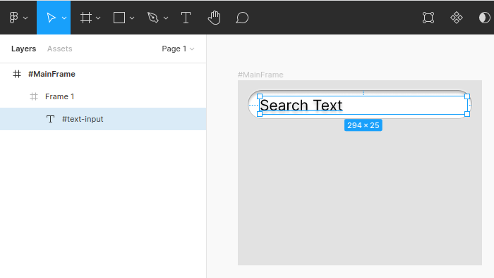
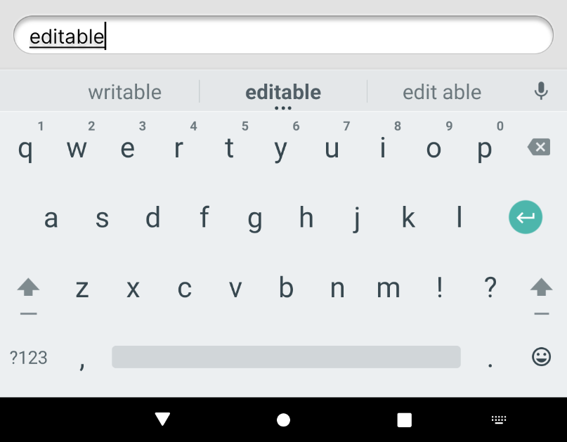
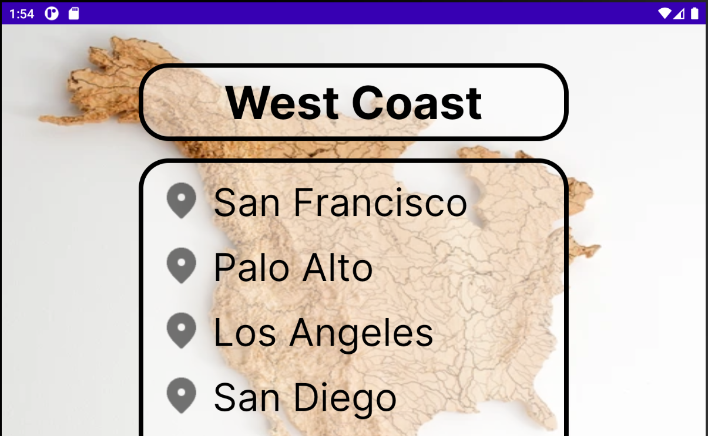
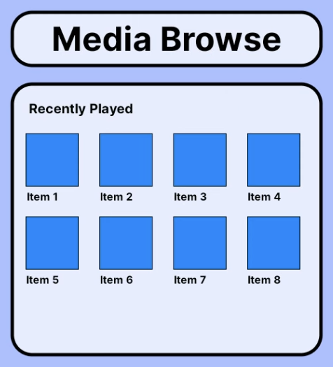
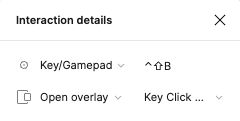



# Design Elements

You use Figma to design and prototype user interfaces in a web browser. You
create design elements with custom code you then apply as customizations to your
user interfaces. Design elements enable you to modify your designs in Figma and
then immediately preview the changes.

DesignCompose lets you to define every screen, component, and overlay in Figma.
Use the design elements described below to create and apply your own
customizations.

## Basic customizations {#basic-customizations}

Customizations are specified as `@Design` attributes on arguments.

The Hello World example uses a Text Content customization (also called a
*string*) to replace `name` with a custom string.

### Text content {#text-content}

The following example uses a `@Design` annotation on an argument with a `String`
type to replace the actual text in a design element. This example creates a
component from a Figma frame called `MainFrame`, which contains a text node
called `#name`. The generated `Composable` function takes a `String` argument
called `name`.

If `#name` doesn't exist, or it isn't a text node such as a frame or vector,
then the customization is ignored. Similarly, if more than one text node called
`name` appears under `MainFrame`, then the text in each is replaced with the
value provided as `name`.

The result is that more data is provided to a design element than it can use.
Alternatively, create a different subset of the data in different designs (for
example, targeting different trim levels).

```kotlin
@DesignDoc(id = "<your figma doc id>")
interface HelloWorld {
    @DesignComponent(node = "#MainFrame")
    fun MainFrame(
        @Design(node = "#name") name: String
    )
}
```

### Text style {#text-style}

The color and size of text can be defined in the code. For example, you can
display a readout in red when a threshold has been exceeded. Either supply a new
text style from the code or use a Figma component as the text element and then
select a variant. We recommend using Figma component variants, which provide
more control and are easier to update. To learn more, see [Create and use
variants][1]{:.external}.

A text style customization generates an Android [`Composable`][2] function,
which accepts the Jetpack Compose `androidx.compose.ui.text.TextStyle` type
(Composables are the building blocks of apps built with Compose.) The following
example creates a `Composable` in which both the content and style of the
`#name` are customized by arguments to the function.

The following example creates a text style:

```kotlin
@DesignDoc(id = "<your figma doc id>")
interface HelloWorld {
    @DesignComponent(node = "#MainFrame")
    fun MainFrame(
        @Design(node = "#name") name: String,
        @Design(node = "#name") textStyle: TextStyle
    )
}
```

### Text content with State {#text-content-with-state}

Text content can also be customized using a `State<String>`. Using a `State` can
have performance benefits because reading the `value` out of a `State` will only
cause the closest `@Composable` function in the call stack to be recomposed,
whereas the simpler `String` customization will always recompose the function
that uses the customization. By using a string State instead of a string value,
you can extend the time needed to read a state, which allows Compose to run less
code when recomposing because it reads the state only when necessary.

In this example, the `State<String>` replaces `text` in a design element.

```kotlin
@DesignDoc(id = "<your figma doc id>")
interface HelloWorld {
    @DesignComponent(node = "#MainFrame")
    fun MainFrame(
        @Design(node = "#name") name: State<String>
    )
}
```

### Image content {#image-content}

Use a `Bitmap` customization to use an image to replace the background fill of a
frame. This customization accepts a nullable `android.graphics.Bitmap`, which is
used to fill the frame.

The example below creates an image content customization:

```kotlin
@DesignDoc(id = "<your figma doc id>")
interface HelloWorld {
    @DesignComponent(node = "#MainFrame")
    fun MainFrame(
        @Design(node = "#button") artwork: Bitmap?,
    )
}
```

In this example, the generated Composable, `MainFrame` takes a single argument
called `artwork`, which is a nullable `android.graphics.Bitmap` instance. To use
the background fill from the document, pass a value to replace the background
fill or pass `null`.

### Image with context {#image-context}

To replace the background of an image given some additional data about the background
being replaced, use the `(ImageReplacementContext) -> Bitmap?)` customization.
Provide a function that takes the context and returns a `Bitmap?`. The
`ImageReplacementContext` parameter contains size and color data of the image in the
Figma node. In the example below, the node's background image is assumed to be a solid
color, and is replaced by another solid color generated by muliplying the original
color values by 0.5.

```kotlin
@DesignDoc(id = "<your figma doc id>")
interface HelloWorld {
    @DesignComponent(node = "#MainFrame")
    fun MainFrame(
        @Design(node = "#Square") squareReplacement: (ImageReplacementContext) -> Bitmap?
    )
}

HelloWorldDoc.MainFrame(
    squareReplacement = { context ->
        val color =
            ((context.imageContext.getBackgroundColor() ?: Color.Red.toArgb()) * 0.5).toInt()
        val width = context.imageContext.getPixelWidth() ?: 50
        val height = context.imageContext.getPixelHeight() ?: 50
        val colors = IntArray(width * height)
        for (i in 0 until width * height) {
            colors[i] = color
        }
        Bitmap.createBitmap(colors, width, height, Bitmap.Config.ARGB_8888)
    }
)
```

### Brush content {#brush-content}

Jetpack Compose's `Brush` type can be used to fill text or a frame. A `Brush`
can render gradients, images, colors, and AGSL Fragment Shaders (on Android T
and above).

The `Brush` customization can take either a `Brush` directly, or a function
`() -> Brush`, for example:

```kotlin
@DesignDoc(id = "<your figma doc id>")
interface HelloWorld {
    @DesignComponent(node = "#MainFrame")
    fun MainFrame(
        @Design(node = "#background") background: Brush,
        @Design(node = "#animated-background") animatedBackground: () -> Brush,
    )
}
```

In this example, the generated Composable, `MainFrame`, takes a `Brush` and
a function that generates a `Brush`. We could use `MainFrame` like so:

```kotlin
// Create a State<Float> that is animated by Compose's animation system.
val infiniteTransition = rememberInfiniteTransition(label = "animate shader")
val movingValue = infiniteTransition.animateFloat(
    label = "moving value for shader",
    initialValue = 0.0f,
    targetValue = 100.0f,
    animationSpec = infiniteRepeatable(
        animation = tween(1000, easing = FastOutSlowInEasing),
        repeatMode = RepeatMode.Reverse
    )
)

// Now present our MainFrame.
MainFrame(
    background = Brush.verticalGradient(listOf(Color.Red, Color.Blue)),
    animatedBackground = {
        Brush.verticalGradient(
            listOf(Color.Red, Color.Blue),
            startY = 0.0f,
            // By reading `movingValue.value` here, inside the Brush generator function, we avoid
            // recomposing the UI every frame and instead only trigger a redraw.
            endY = movingValue.value
        )
    }
)
```

### Visibility {#visibility}

The following example illustrates how to create a visibility customization to
control the visibility of a design element:

```kotlin
@DesignDoc(id = "<your figma doc id>")
interface HelloWorld {
    @DesignComponent(node = "#MainFrame")
    fun MainFrame(
        @Design(node = "#name") showText: Boolean,
    )
}

HelloWorldDoc.MainFrame(showText = false)
```

The generated `MainFrame` `Composable` function contains a single `Boolean`
argument called `showText`, which controls the visibility of the Figma node
called `#name`.

Visibility can also be customized using a `State<Boolean>`. Using a `State` can
have performance benefits because reading the `value` out of a `State` will only
cause the closest `@Composable` function in the call stack to be recomposed,
wherease the simpler `Boolean` customization will always recompose the function
that uses the customization. The following example illustrates how to use a
`State<Boolean>` as the visibility customization type:

```kotlin
@DesignDoc(id = "<your figma doc id>")
interface HelloWorld {
    @DesignComponent(node = "#MainFrame")
    fun MainFrame(
        @Design(node = "#name") showText: State<Boolean>,
    )
}

val showText = remember { mutableStateOf(true) }
LaunchedEffect(Unit) {
    while (true) {
        delay(1000)
        showText.value = !showText.value
    }
}

HelloWorldDoc.MainFrame(showText = showText)
```

### Component variants {#component-variants}

Variants are a great way to create different variations of a component. To
create Component Variants in Figma, see [Creating and organizing
Variants][3]{:.external}. To support variants, the macro supports a new
`@DesignVariant` annotation.

Do the following to create a reusable component with variants:

1.  Create a `@DesignComponent` as usual with the node name being the name of
    the component set. That is, the parent of all the variants.

2.  Create a `@DesignVariant` parameter for each property. The `property`
    annotation parameter takes the name of the property in Figma and the
    parameter type is an `enum` that has a value for every variant name of that
    property.

In the following example, the `#Square` component set has two variant
properties. The `#SquareShadow` variant property has two values described by the
`SquareShadow` `enum`: `On` and `Off`. The `#SquareColor` variant property has
three values described by the `SquareColor` `enum`: `Red`, `Green`, and `Blue`.

To use the generated function, fill in the parameters with the corresponding
`enum` values. The following example shows how to implement enum classes
`SquareColor` and `SquareShadow` as described in this section:

```kotlin
enum class SquareColor {
    Red,
    Green,
    Blue
}

enum class SquareShadow {
    On,
    Off
}

@DesignDoc(id = "<your figma doc id>")
interface VariantTest {
    @DesignComponent(node = "#PurpleCircle")
    fun PurpleCircle() {}
    @DesignComponent(node = "#Square")
    fun Square(
        @DesignVariant(property = "#SquareShadow") shadow: SquareShadow,
        @DesignVariant(property = "#SquareColor") color: SquareColor,
        @Design(node = "#icon") icon: @Composable () -> Unit
    )
}

VariantTestDoc.Square(
    shadow = SquareShadow.On,
    color = SquareColor.Green,
    icon = { SwitcherTestDoc.PurpleCircle() }
)
VariantTestDoc.Square(
    shadow = SquareShadow.On,
    color = SquareColor.Red,
    icon = { SwitcherTestDoc.PurpleCircle() }
)
```

### Component replacement {#comp-replace}

A node in a design can be replaced with a [`Composable`][2] of your choice while
retaining the style information provided by the designer. The difference between replacing
versus adding descendants (as shown in [Creating lists][5] is that a replaced Figma design
element isn't rendered.

The example below describes a simple way to replace a component. The `placeholderButton` parameter
takes the type `@Composable (ComponentReplacementContext) -> Unit`, which means that while
traversing the UI tree, it will replace any node named `#placeholder-button` with the composable
specified by the parameter. In this example, the `placeholderButton` is replaced by the node
`#replacement-button` by calling the generated function `HelloWorldDoc.ReplacementButton()`.

```kotlin
@DesignDoc(id = "<your figma doc id>")
interface HelloWorld {
    @DesignComponent(node = "#MainFrame")
    fun MainFrame(
        @Design(node = "#placeholder-button") placeholderButton: @Composable (ComponentReplacementContext) -> Unit,
    )
    @DesignComponent(node = "#replacement-button")
    fun ReplacementButton()
}

@Composable
fun Main() {
    HelloWorldDoc.MainFrame(
        button = {
            HelloWorldDoc.ReplacementButton()
        }
    )
}
```

The above example ignores the `ComponentReplacementContext` parameter, as it is often not needed.
However, it can be used to obtain extra data about the node being replaced.
The `ComponentReplacementContext` object provides
a field to access the layout properties of the replaced element, and another field
to access the text style if the replaced element is a text node. Doing so allows a
replacement component to take on the designer specified size, position, and text
appearance while offering more behavioral changes than are permitted with simple
Modifier customizations. For example, replacing a styled text node with a
complete text field.

```kotlin
interface ComponentReplacementContext {
    // Return the custom layout modifier that this component would have used so that the layout
    // function can retrieve the component's layout properties. When replacing a node with a
    // composable that is not a DesignCompose generated function, such as a simple Box() or an
    // AndroidView, this modifier should be used as a modifier for that component in order for it to
    // retain the original node's layout (size, position) properties.
    val layoutModifier: Modifier

    // Return the text style, if the component being replaced is a text node in the Figma
    // document.
    val textStyle: TextStyle?
}
```

As shown in the first example, when replacing a node with another DesignCompose generated composable,
the `layoutModifier` from the `ComponentReplacementContext` can be ignored. DesignCompose will
automatically use the original node's layout properties, but compose the replacement node instead.
When replacing a node with a composable that was not generated by DesignCompose, that composable
does not call into any DesignCompose code, and thus has no knowledge of the original node's layout.
In order to use the original node's size and position, the replacement composable should use the
`layoutModifier` from `ComponentReplacementContext`. The example below describes how to do this
with a `Box` as the replacement composable:

```kotlin
HelloWorldDoc.MainFrame(
    button = { context: ComponentReplacementContext ->
        Box(
            Modifier.background(Color.Green) // draw the box green
            .then(context.layoutModifier) // take the size and position of the original node
        )
    }
)
```

The next section on [text input](#text-input) explains how to use the `textStyle` field to retain
the designer's style for text input.

## Text input {#text-input}

This section addresses how to add text input fields to an app.

To add text input fields to an app when using the designer-provided style for
the text, use [Component replacement][6].

```kotlin
@DesignDoc(id = "<your figma doc id>")
interface HelloWorld {
    @DesignComponent(node = "#MainFrame")
    fun MainFrame(
        @Design(node = "#text-input") textInput: @Composable (ComponentReplacementContext) -> Unit,
    )
}

// Usage in a Composable, or in `setContent`:
val (text, setText) = remember { mutableStateOf("editable") }
HelloWorldDoc.MainFrame(Modifier.fillMaxSize()) { context ->
    BasicTextField(
        modifier = context.layoutModifier,
        value = text,
        onValueChange = setText,
        textStyle = context.textStyle ?: TextStyle.Default
    )
}
```

The illustration below shows a document that contains a text node named
`#text-input`:



**Figure 1.** Text input in Figma

This creates a text field that contains the designer-defined style of the text
node, including font, color, OpenType properties, and shadows.



**Figure 2.** Text input in Android

In this example, the text shadow you added is rendered by `BasicTextField`. When
the text field contains content, the content can be concealed. In addition, add
a placeholder text element in your design and use a [Visibility][7]
customization.

## Lists {#creating-lists}

The customizations described above populate simple data into our design
elements. If you have list data to represent, you can use the Auto Content
Preview widget to specify list layout options and preview its contents. On the
developer side, you need a few things:

*   A `ListContent` type parameter that represents the list item
*   The ability to replace the descendants of a Figma node with other
    Composables
*   Use of the `@DesignContentTypes` macro to specify the node names of items
    that go into the list. These are the layer names of components and frames in
    Figma. To specify that any variant of a component set can be included in the
    list, use the name of the component set. This goes with an `@Design`
    annotation on a parameter of type `@Composable () -> Unit`. For example:

    ```kotlin
        @DesignContentTypes(nodes = ["#SectionTitle", "#Item", "#LoadingPage"])
        @Design(node = "#BrowseList") items: ListContent
    ```

*   Use of the `@DesignPreviewContent` macro to provide preview content for the
    Auto Content Preview widget. You can use this macro multiple times, with
    each creating a preview content page that can be selected from a menu in the
    widget. For example, if a list can consist of either a list of items or a
    loading page, you might specify the following two preview content pages:
    *   A `Loading` page that includes a `#Loading` item
    *   A `LoadedList` page that includes a `#SectionTitle` item followed by
        eight `#Item=List` items

    These pages go with an `@Design` annotation on a parameter of type
        `ListContent`.

*   The `@DesignContentTypes` and `@DesignPreviewContent` annotations, which
    generate a JSON file at build time. Check the output folder of your build to
    find the file and use the Auto Content Preview widget to upload it, or give
    it to your designer to upload. Without this file, the widget can't be used
    to configure and preview the grid layout.

This example shows how to generate two Composables: one that works as a list
item, and one that contains the list items. This example uses [this Figma
document][8].

Note: If you'd like to try this example, make a duplicate of the document and
copy out the Figma document ID.

```kotlin
@DesignDoc(id = "<your figma doc id>")
interface HelloList {
    @DesignComponent(node = "#ListItem")
    fun ListItem(
        @Design(node = "#title") title: String
    )
    @DesignComponent(node = "#ListMainFrame")
    fun MainFrame(
        @Design(node = "#listTitle") listTitle: String,
        @DesignContentTypes(nodes = ["#ListItem"])
        @DesignPreviewContent(
            name = "City List",
            nodes = [ PreviewNode(6, "#ListItem") ]
        )
        @Design(node = "#locations") items: ListContent,
    )
}
```

This example generates a `Hello.ListItem` component, which takes a `String` to
replace the `#title` text node. This also generates a `Hello.MainFrame`
component, which takes a `ListContent` closure that can generate descendants.
You can use these components in the `MainActivity` as follows:

```kotlin
class MainActivity : ComponentActivity() {
    override fun onCreate(savedInstanceState: Bundle?) {
        super.onCreate(savedInstanceState)

        setContent {
            // Hello.MainFrame takes a "listTitle" and an ListContent closure, which is a function
            // that returns a ListContentData class. The only required fields here are the count,
            // or number of items in the list, and the composable closure with the actual list
            // contents. Because the closure is the last argument, we can move the closure
            // outside of the parenthesis.
            val cities = arrayListOf(
                "San Francisco",
                "Palo Alto",
                "Los Angeles",
                "San Diego",
                "Portland",
                "Seattle"
            )
            HelloListDoc.MainFrame(Modifier.fillMaxSize(), listTitle = "West Coast") {
                ListContentData(count = 6) { index ->
                    HelloListDoc.ListItem(title = cities[index])
                }
            }
        }
    }
}
```

The following sample document (***requires login to Figma to view***) contains
the `#ListItem` with a `#title` text node and `#ListMainFrame` with a
`#listTitle` text node and a `#locations` frame.

<center>
<iframe style="border: 1px solid rgba(0, 0, 0, 0.1)" width="800" height="450" src="https://www.figma.com/embed?embed_host=share&url=https%3A%2F%2Fwww.figma.com%2Ffile%2FaOb2Mm1RMQe8UJhPegPEpP%2FVsw-Compose-List-Example" allowfullscreen></iframe>
</center>

Running the example using the Figma document ID of a clone of that document
displays the `#ListMainFrame` with a title and some list items based on the
`#ListItem` frame:



**Figure 3.** A list in Android

## Grid layout with the Auto Content Preview widget {#grid-layout}

If you want to arrange list items in a grid format instead of a single
horizontal or vertical list, use the Auto Content Preview widget to specify grid
layout options and preview its contents. Here's an example of a grid layout:

```kotlin
    @DesignContentTypes(nodes = ["#SectionTitle", "#Item", "#LoadingPage"])
    @DesignPreviewContent(
        name = "Loading",
        nodes = [PreviewNode(1, "#Loading")]
    )
    @DesignPreviewContent(
        name = "LoadedList",
        nodes =
        [
            PreviewNode(1, "#SectionTitle"),
            PreviewNode(8, "#Item=List"),
        ]
    )
    @Design(node = "#BrowseList") items: ListContent,
```

When populating the `ListContent` type parameter, additional grid parameters are
required. `ListContent` takes a `spanFunc` parameter, which is a function that
returns the span of an item as specified by the widget, and returns a
`ListContentData` class. Here's an example of how to create `ListContent`:

```kotlin
{ spanFunc ->
    ListContentData(
        // Number of items in the list
        count = 9,
        // Span of each item
        span = { index ->
            if (index == 0)
                // Get and return the span for the SectionTitle composable
                spanFunc { GridLayoutDoc.SectionTitleDesignNodeData() }
            else
                // Get and return the span for the ItemList composable with variant Grid
                spanFunc { GridLayoutDoc.ItemDesignNodeData(itemType = ItemType.Grid) }
        },
    ) { index ->
        // Composable for each item
        if (index == 0)
            GridLayoutDoc.SectionTitle(title = "Recently Played")
        else
            GridLayoutDoc.Item(itemType = ItemType.Grid, title = "Item $index")
    }
```

The next example populates a grid view that contains four columns with nine
items, as specified by the designer in the Auto Content Preview widget. The
first item is a `SectionTitle`. Since the designer specified that a
`SectionTitle` element span all four columns, the entire first row is used. Each
of the next eight items of type `Item` spans one column. They are organized from
left to right until four columns are filled, after which a new row is created,
starting on the left.

```kotlin
enum class ItemType {
  Grid,
  List
}

@DesignDoc(id = "<your doc id>")
interface GridLayout {
  @DesignComponent(node = "#stage") fun MainFrame(
    @Design(node = "#ListTitle") title: String,
    @DesignContentTypes(nodes = ["#SectionTitle", "#Item", "#Loading"])
    @DesignPreviewContent(
      name = "Loading",
      nodes = [PreviewNode(1, "#Loading")]
    )
    @DesignPreviewContent(
      name = "LoadedList",
      nodes =
      [
        PreviewNode(1, "#SectionTitle"),
        PreviewNode(8, "#Item=Grid"),
      ]
    )
    @Design(node = "#BrowseList") items: ListContent,
  )
  @DesignComponent(node = "#SectionTitle") fun SectionTitle(
    @Design(node = "#Title") title: String
  )
  @DesignComponent(node = "#LoadingPage") fun LoadingPage()
  @DesignComponent(node = "#Item") fun Item(
    @DesignVariant(property = "#Item") itemType: ItemType,
    @Design(node = "#Title") title: String
  )
}

class MainActivity : ComponentActivity() {
    override fun onCreate(savedInstanceState: Bundle?) {
        super.onCreate(savedInstanceState)
        setContent {
            GridLayoutDoc.MainFrame(
                title = "Media Browse",
                items = { spanFunc ->
                    ListContentData(
                        count = 9,
                        span = { index ->
                            if (index == 0)
                                spanFunc { GridLayoutDoc.SectionTitleDesignNodeData() }
                            else
                                spanFunc { GridLayoutDoc.ItemDesignNodeData(itemType = ItemType.Grid) }
                        },
                    ) { index ->
                        if (index == 0)
                            GridLayoutDoc.SectionTitle(title = "Recently Played")
                        else
                            GridLayoutDoc.Item(itemType = ItemType.Grid, title = "Item $index")
                    }
                }
            )
        }
    }
}
```

The Figma document is displayed below. The content specified in the
`@DesignPreviewContent` annotation populates the grid design in Figma.


**Figure 4.** Grid view in Figma

The live view appears below after replacing the data with live content.



**Figure 5.** Grid view in Android

## Callback customizations {#callback-customizations}

When a design element is tapped with the `TapCallback` customization, add a
callback function. Although the `Modifier` customization can be used to handle
taps, `TapCallback` can be combined with Figma interactions that involve tapping
or pressing.

```kotlin
@DesignDoc(id = "<your figma doc id>")
interface HelloWorld {
    @DesignComponent(node = "#MainFrame")
    fun MainFrame(
        @Design(node = "#button") onTapButton: TapCallback,
    )
}
```

This example uses a `TapCallback` customization on a descendant of the original
"Hello World" MainFrame from the first example:

```kotlin
class MainActivity : ComponentActivity() {
    override fun onCreate(savedInstanceState: Bundle?) {
        super.onCreate(savedInstanceState)

        setContent {
            HelloWorldDoc.MainFrame(
                onTapButton = {
                    Log.i("App", "My button was clicked!")
                }
            )
        }
    }
}
```

## Dials, gauges and progress bars {#dials,-gauges}

A designer can use the Dials and Gauges plugin to configure a node to behave as
a dial, gauge, or progress bar. To support this, you need to use a `Meter` type
customization on that node. The designer specifies the start and end positions
of the meter as well as how it moves, and you just need to provide a value for
this meter as a Float between `0` and `100`. For example:

```kotlin
@DesignDoc(id = "<your figma doc id>")
interface HelloWorld {
    @DesignComponent(node = "#MainFrame")
    fun MainFrame(
        @Design(node = "#progress") progress: Meter,
    )
}
```

This customization specifies that the "#progress" node should be treated as a
`Meter`. It doesn't matter what type of `Meter` it is; that is up to the
designer. As a developer you just need to provide it with a value. Below,
progress is set to 50F, or 50%:

```kotlin
class MainActivity : ComponentActivity() {
    override fun onCreate(savedInstanceState: Bundle?) {
        super.onCreate(savedInstanceState)

        setContent {
            HelloWorldDoc.MainFrame(
                progress = 50F
            )
        }
    }
}

```

## Key Injection {#key-injection}

Figma supports interactions with a keyboard event as the trigger. For example, a
designer can set up an interaction that opens an overlay when a particular key
event is detected, such as **Ctrl-Shift-B**, which appears as follows:



You can then inject this key event whenever you want to trigger the interaction.
The `@DesignKeyAction` annotation takes a key and a list of meta keys and
generates a function that injects that key event when called. The meta keys
supported are `MetaShift`, `MetaCtrl`, `MetaMeta`, and `MetaAlt`. For example,
the function declaration `@DesignKeyAction(key = 'B', metaKeys =
[DesignMetaKey.MetaShift, DesignMetaKey.MetaCtrl]) fun injectCtrlShiftB()`
generates a function `injectCtrlShiftB()` that injects the key event of pressing
the keys **B** with **Ctrl** and **Shift**.

The following example generates two functions that inject key events and calls
them when nodes are tapped. In a real application, the key inject functions
would probably be called in a different scenario since you can set up a click
trigger interaction for this purpose.

```kotlin
@DesignDoc(id = "<your figma doc id>")
interface HelloWorld {
    @DesignComponent(node = "#MainFrame")
    fun MainFrame(
        @Design(node = "#KeyTest1") onTapKey1: TapCallback,
        @Design(node = "#KeyTest2") onTapKey2: TapCallback,
    )

    @DesignKeyAction(key = 'A', metaKeys = [])
    fun injectA()
    @DesignKeyAction(key = 'B', metaKeys = [DesignMetaKey.MetaShift, DesignMetaKey.MetaCtrl])
    fun injectCtrlShiftB()
}

@Composable
class MainActivity : ComponentActivity() {
    override fun onCreate(savedInstanceState: Bundle?) {
        super.onCreate(savedInstanceState)

        setContent {
            HelloWorldDoc.MainFrame(
                onTapKey1 = { HelloWorldDoc.injectA() },
                onTapKey2 = { HelloWorldDoc.injectCtrlShiftB() },
            )
        }
    }
}

```

## Modifier customizations {#modifier-customizations}

Jetpack Compose defines the appearance, layout, and interaction behaviors using
a list of `Modifier`s attached to each Composable. The Jetpack Compose
documentation provides a [List of Compose modifiers][9]. Modifiers can be
provided to any of the Design Elements. Behaviors can be added to the modifiers.

This example uses a Modifier customization on a descendant of the original
"Hello World" MainFrame:

```kotlin
import android.util.Log
import androidx.compose.ui.Modifier
import androidx.compose.foundation.clickable

@DesignDoc(id = "<your figma doc id>")
interface HelloWorld {
    @DesignComponent(node = "#MainFrame")
    fun MainFrame(
        @Design(node = "#button") buttonModifier: Modifier,
    )
}
```

When the `#button` element is tapped, use a `Modifier.clickable` to be notified:

```kotlin
class MainActivity : ComponentActivity() {
    override fun onCreate(savedInstanceState: Bundle?) {
        super.onCreate(savedInstanceState)

        setContent {
            HelloWorldDoc.MainFrame(
                buttonModifier = Modifier.clickable() {
                    Log.i("App", "My button was clicked!")
                }
            )
        }
    }
}
```

Compose provides numerous Modifiers, including animation and graphics contexts.

Note: Every generated component takes a `Modifier` as its first parameter. For
example, if you wanted a `ListItem` from the lists example to be clickable, pass
a `Modifier.clickable` during construction. The component declaration stays the
same.

```kotlin
@DesignDoc(id = "<your figma doc id>")
interface HelloList {
    @DesignComponent(node = "#ListItem")
    fun ListItem(
        @Design(node = "#title") title: String
    )
}
```

For example:

```kotlin
ListItem(Modifier.clickable { Log.i("MyApp", "clicked!") }, title = "Click Me")
```

## Automatically generated arguments {#automatically-generated}

In addition to the @DesignComponent parameters specified in the macro, every
generated @DesignComponent function generates these three optional parameters:

*   `modifier: Modifier = Modifier`. As explained in the `Modifier` section
    above, this `Modifier` applies to the design element represented by this
    function and defaults to the empty `Modifier`.

*   `openLinkCallback: OpenLinkCallback? = null`. The `openLinkCallback`
    parameter can be populated to receive the Open link Figma interaction. For
    example, if a node within the main frame is set up with an Open link
    interaction when clicked, pass a function into the `openLinkCallback`
    parameter to capture the event.

    This example illustrates how to use `openLinkCallback`:

    ```kotlin
     HelloWorldDoc.MainFrame(
         name = "Test Name",
         openLinkCallback = OpenLinkCallback { url -> Log.i("DesignCompose", "Open Link: $url") }
     )
    ```

*   `key: String? = null`. Use the `key` parameter to uniquely identify an
    element. This is typically needed only on an element that has multiple
    instances at the same time. For example, if you have a list of media items
    and opt to represent each item as a `@DesignComponent` function called
    `MediaItem()`, then pass in a unique `key` parameter to each `MediaItem()`
    function. This ensures that if `MediaItem()` is a `@DesignVariant` and there
    are any interactions that change the variant, executing that interaction
    takes place only on the affected `MediaItem()`.

    For example, this code contains a frame called `#Content` that's populated
    with a list of `#ButtonVariant` nodes.

    ```kotlin
    @DesignDoc(id = "<your figma doc id>")
    interface HelloWorld {
        @DesignComponent(node = "#MainFrame")
        fun Main(
            @Design(node = "{{ '<strong>' }}#Content{{ '</strong>' }}") content: @Composable () -> Unit
        )
        @DesignComponent(node = "#ButtonVariant")
        fun ButtonVariant(
            @DesignVariant(property = "#ButtonVariant") type: ItemType,
            @Design(node = "#Title") title: String,
            @Design(node = "#ButtonVariant") onTap: TapCallback
        )
    }
    ```

*   `designComposeCallbacks: DesignComposeCallbacks? = null`. Set this parameter
    to register callbacks for a certain events. The `DesignComposeCallbacks` class
    supports the following event callbacks:
    *   `docReadyCallback: ((String) -> Unit)? = null` \
        This callback is called when the Figma document has loaded is ready to be rendered.
    *   `newDocDataCallback: ((String, ByteArray?) -> Unit)? = null` \
        This callback is called both when the Figma document has first loaded and whenever it
        updates from live update changes. The ByteArray passed in contains the serialized Figma
        file.

This example illustrates the use of unique keys to ensure all `#ButtonVariant`
instances are unique:

```kotlin
HelloWorldDoc.MainFrame(
    content = {
        HelloWorldDoc.ButtonVariant(
            type = ItemType.List,
            title = "One",
            onTap = { println("Tap One") },
            key = "One"
        )
        HelloWorldDoc.ButtonVariant(
            type = ItemType.List,
            title = "Two",
            onTap = { println("Tap Two") },
            key = "Two"
        )
        HelloWorldDoc.ButtonVariant(
            type = ItemType.List,
            title = "Three",
            onTap = { println("Tap Three") },
            key = "Three"
        )
    }
)
```

These three automatically generated arguments appear at the beginning of every
generated function. Code for the original Hello World example is as follows.

```kotlin
@DesignDoc(id = "<your figma doc id>")
interface HelloWorld {
    @DesignComponent(node = "#MainFrame")
    fun Main(@Design(node = "#Name") name: String)
}
```

The generated code appears like this:

```kotlin
@Composable
fun Main(
    modifier: Modifier = Modifier,
    openLinkCallback: OpenLinkCallback? = null,
    key: String? = null,
    name: String,
) {
    ...
}
```

[1]: https://help.figma.com/hc/en-us/articles/360056440594-Create-and-use-variants
[2]: https://developer.android.com/reference/kotlin/androidx/compose/runtime/Composable
[3]: https://www.figma.com/best-practices/creating-and-organizing-variants/
[5]: #creating-lists
[6]: #comp-replace
[7]: #visibility
[8]: https://www.figma.com/file/aOb2Mm1RMQe8UJhPegPEpP/Vsw-Compose-List-Example
[9]: https://developer.android.com/jetpack/compose/modifiers-list
