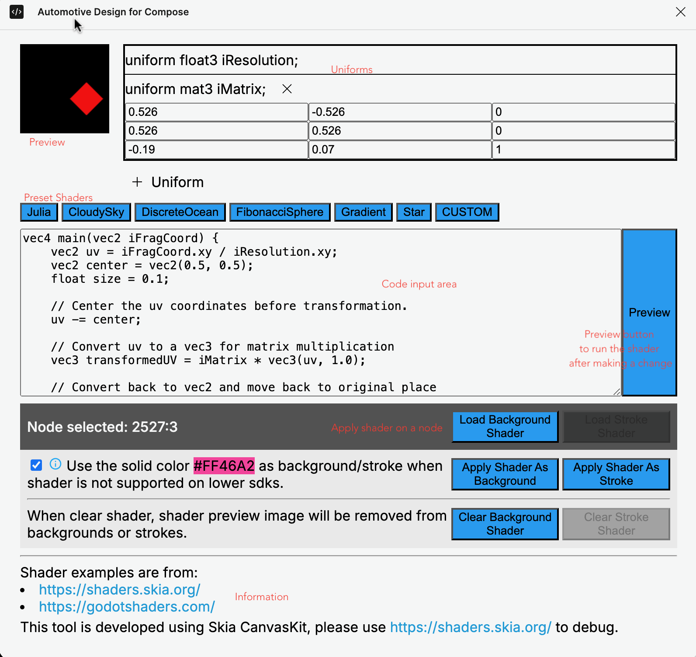



# Shader

## Introduction

This document provides a guide how to use the Shader Plugin in Figma. This plugin allows designers to
apply custom shaders to their designs, enhancing visual effects and interactivity.

The plugin is built using Skia's CanvasKit and has a few pre-built shader examples from the
[skia shader playground][1] and <https://godotshaders.com/>. The [skia shader playground][1] is also
the recommended place to compile and debug your shader code before entering them into our shader plugin.

This document also provides instructions how to customize shader uniform values, allowing developers
to achieve different visual effects using the same shader code but with different uniform values.

## Plugin Features

The Shader Plugin offers a variety of features:

- **Apply Shaders:** Users can apply shaders to the background or strokes of any compatible node in
  Figma. It also generates a preview image to insert as the background or stroke.
- **Pre-built Shaders:** The plugin provides a selection of pre-built shaders.
- **Custom Shader:** The plugin allows a user to modify the pre-built shaders or write their own shader.
- **Uniforms:** Create uniforms and set uniform values for shaders.
- **Load Saved Shaders**: Load the applied shader from a figma node to the plugin.
- **Clear Shaders:** Easily remove applied shaders and preview images from a selected node.
- **Clear all**: Remove all the shaders including the preview image from the file.



### Usage

#### Applying Shaders

1. **Node Selection:** Select a node in Figma that supports image fills or strokes.
2. **Plugin Interface:** Open the Shader Plugin interface.
3. **Shader Selection:** Choose a shader from the provided list or input your own shader code.
4. **Uniform Adjustment:** Create shader uniforms as needed.
5. **Apply:** Apply the shader to the node's background or stroke.

When applying the shader as background or stroke, we provide an option to use a fallback color on
lower sdks where Android doesn't support RuntimeShader.


- By checking this box, the node with a shader set will render a highlight pink color to indicate that
  shader is not working on the device.
- While unchecked, the node will render the background fills, which is the shader preview image, if it
  is not altered by the designer.

#### Clearing Shaders

You can either clear a background or stroke shader from a node:

1. **Node Selection:** Select the node from which you want to clear the shader.
2. **Plugin Interface:** Open the Shader Plugin interface.
3. **Clear:** Choose the clear option to remove the shader from the background or stroke.

or use the "Clear All Shaders" plugin menu to remove all the shaders from the current file.

#### Supported Uniforms

Uniforms are variables that can be used by the shader code. We don't parse user's input so all the uniforms
need to be created using our `+ Uniform` button.


Here are the supported types:

- float: A single floating-point number.
  - iTime: A special float uniform that simulates time. We ask users to only create it when it is used
    in the shader code so when DesignCompose renders it, we only set the iTime uniform when it is
    used to avoid unnecessary redraw.
- half: Similar to float, but with reduced precision.
- float2, float3, float4: Vectors of 2, 3, or 4 floating-point numbers, respectively.
  - color3, color4: Colors represented as RGB (color3) or RGBA (color4) values, whose real shader uniform
    types are float3 and float4 accrodingly.
- half2, half3, half4: Similar to float vectors, but with reduced precision.
- mat2, mat3, mat4: Matrices of 2x2, 3x3, or 4x4 floating-point numbers.
- half2x2, half3x3, half4x4: Similar to mat, but with reduced precision.
- int: A single integer number.
- int2, int3, int4: Vectors of 2, 3, or 4 integer numbers.
- shader: Refers to another shader, used to create nested shaders. Right now it supports loading
  an image as input and apply effects on the image using shader code.

For image uniform, an image resolution uniform with type `float2` will be created together. The image
uniform now only supports uploading from the disk and when the image is loaded, it will set the image
size to the image resolution uniform and rerun the shader to preview with the image input. Supported
image types are JPG, PNG and GIF(which only renders the first frame). Other image formats may upload
successfully but will fail to apply as the shader uniform value to the figma node.


Please be aware that the image input is not written to the plugin data. It is added to the background
fills or strokes as an invisible layer. Please do not remove it so DesignCompose can download the image
along with the figma file and apply it to the shader code.


### Limitations

- **Single Node Selection:** The plugin currently supports applying shaders to only one node at a time.
- **API Level:** [Android Graphics Shading Language (AGSL)][2] only works on Android 13 and above.
- **Device Density:** Shaders render differently on varying screen densities. Developers need to implement
  density-aware logic within their shader code to ensure consistent appearance across devices.

## DesignCompose Customization

DesignCompose reads the plugin data from the figma node and transforms the shader data to a RuntimeShader
and a list of shader uniform values to set to the shader. The shader takes priority over the background
fills or strokes. We will only render the shader if a shader is set.

Same as other view attributes, we added support to customize the shader uniform values so developer
can achieve customized visual effects in the app. There are two types of customizations, uniform
customization and uniform state customization, to apply to a node's background shader or stroke shader.
There is also a specific case for `iTime` which is a uniform state customization but it is a shared
customization that is applied to all the nodes.

### iTime

iTime simulates the time and we only support it as a global customization that the design doc
uses the same `iTime` uniform simulation among all the nodes.

We provide an infinite simulation starting from value `0.0f` using `withInfiniteAnimationFrameMillis`
which provides a time source for display frames. See [ShaderHelper.kt][3]. Our implementation:

- Allows for configuring the frame update interval via the [`config_shader_frame_interval_ms` resource][4]
  integer. It will result in roughly the minimum of the display frame rate and `1000/interval`. This
  interval determines the frequency at which the time value is updated, influencing the smoothness of
  the animation. A shorter interval will result in a higher frequency of updates, while a larger
  interval results in fewer updates. This interval can be overridden to ensure optimal performance on
  lower-end Android devices.

- Multiplies the global `ANIMATOR_DURATION_SCALE` setting with the frame interval and can disable
  the shader animation if the user sets the animator duration scale Developer Option to 0.

With DesignCompose `0.34.0`, iTime customization needs to be set manually to the `LocalCustomizationContext.current`:

```kotlin
val iTimeFloatState = ShaderHelper.getShaderUniformTimeFloatState()

LocalCustomizationContext.current.setShaderTimeUniformState(
   iTimeFloatState.toShaderUniformState(ShaderHelper.UNIFORM_TIME)
)
```

In `0.35.0`, it is more flexible that by default, the build processor will create the iTime states
and set it to the `CustomizationContext` using `ShaderHelper`'s default implementation. Meanwhile,
developer can also set their own implementation of the iTime float state to their design component. The
only thing that developers need to do is declare `designFeatures = ["shader"]` in their `DesignDoc`
annotation:

```kotlin
@DesignDoc(id = "TkgjNl81e5joWeAivmIdzm", designFeatures = ["shader"])
```

### Uniforms

Uniform customizations can be built using `ShaderUniformCustomizations` which provides two
methods for backgrounds and strokes respectively:

- `customBackgroundShaderUniforms`
- `customStrokeShaderUniforms`

We also have helper functions to create a shader float uniform, an int uniform, a float array
uniform, an int array uniform and a float color uniform, which are the types supported by a [ShaderUniformValue][5].

Below is an example of how to apply uniform customizations to background shader:

```kotlin
val shaderUniformCustomizations = ShaderUniformCustomizations()
shaderUniformCustomizations.customBackgroundShaderUniforms(
   ShaderHelper.createShaderFloatUniform("speed", 0.05f),
   ShaderHelper.createShaderIntUniform("iCase", 1),
   ShaderHelper.createShaderFloatArrayUniform(
       "iLocation", floatArrayOf(0.3f, 0.7f)),
   Color(LocalContext.current.getColor(R.color.purple_200))
       .toShaderUniform("iColor"),
)
```

With `0.34.0`, image(child shader) uniform values can be customized using a drawable resource but it
is discouraged because it has unexpected behavior when toggling the `Use local resources` option in
the design switcher:

```kotlin
val imageCustomization = ShaderUniformCustomizations()
imageCustomization.customBackgroundShaderUniforms(
    shaderUniform {
        this.name = "iImage"
        this.value = shaderUniformValue {
            imageRefValue = imageRef {
                this.key = ""
                this.resName = "ic_stop_sign"
            }
        }
    }
)
```

In `0.35.0`, we added support to customize image uniform values from a drawable resource.

```kotlin
    val customImageUniform = ShaderUniformCustomizations()
    customImageUniform.customBackgroundShaderUniforms(
        ShaderHelper.createShaderImageResourceUniform("iImage", R.drawable.ic_stop_sign)
    )
```

It is also possible to do a customization using `com.google.protobuf.ByteString` from other input
sources. See [ImageBytes][6] proto definition.

### Uniform States

Uniform state customizations can be built using `ShaderUniformCustomizations` which provides
methods for backgrounds and strokes respectively:

- `customBackgroundShaderUniformStates`
- `customStrokeShaderUniformStates`

We also have helper functions to create a shader float uniform state from a `FloatState`,
an int uniform state from an `IntState`, a float color uniform state from `State<Color>`, a float
array uniform state from `State<FloatArray>`, and an int array uniform state from `State<IntArray>`.

Below is an example how to apply uniform state customizations to background shader:

```kotlin
val intState = remember {
   derivedStateOf { iTimeFloatState.floatValue.toInt() % 5 }.asIntState()
}
val colors =
   listOf(
       Color(LocalContext.current.getColor(R.color.purple_200)),
       Color(LocalContext.current.getColor(R.color.purple_700)),
   )
val colorState = remember { derivedStateOf { colors[iTimeFloatState.floatValue.toInt() % 2] } }

val customStates = ShaderUniformCustomizations()
customStates.customBackgroundShaderUniformStates(
   intState.toShaderUniformState("iCase"),
   colorState.toShaderUniformState("iColor"),
)
```

### Apply Customization to Design

After creating the shader uniform customizations, they can be applied similarly to other types of
customizations:

```kotlin
interface BrushFromShaderPluginTest {
   @DesignComponent(node = "#stage")
   fun MainFrame(
       @Design(node = "#stage") rootShaderUniformCustomizations: ShaderUniformCustomizations,
       @Design(node = "#color-custom") customColors: ShaderUniformCustomizations,
   )
}
```

## Shader and Animations on Components

When a component transitions from variant A to variant B via either Figma interaction or programmatically
changing variants, it can perform an [animation][7]. The animation animates layout size, background and
opacity etc. When applying a shader to the component or its descendent views, we are now also able to
animate the shader background or stroke by interpolating its uniform values. However, the animation will
only be performed when:

- The shader itself doesn't animate over time.
- The variants are using the same shader code but with different uniform values.

And the animation only animates a float, a float vector or a matrix which can produce continuous intermediate
values. So only the following uniform types are supported:

- float, half
- float2, float3, float4, half2, half3, half4
  - including color3, color4 which are presented using float3 and float4.
- mat2, mat3, mat4, half2x2, half3x3, half4x4

The current animation support doesn't count the customization values in the animation due to the complexity.
It will only animate the uniform value set by the figma plugin. If there is a customization, the customized
value will be set to the shader instead of the animated value.

## Multi-doc support

We support different versions of designs. If the same node from different design docs use different
shaders or a different set of shader uniforms, the customizations can include the joint set of customized
shader uniforms where undeclared uniforms will be ignored.

## Troubleshooting

If you encounter any issues while using the Shader Plugin, try the following:

- **Compile and Debug using Skia Playground:** Skia playground provides a powerful debug tool and
  the UI is more user friendly to see the compilation errors.
- **Check the Figma Console:** Ensure no errors are present in the Figma console.
- **Reload:** Reload the plugin or restart Figma.
- **Contact Support:** If problems persist, [get in touch][8] with our team for support.

Any suggestions will be welcomed.

[1]: https://shaders.skia.org/
[2]: https://developer.android.com/develop/ui/views/graphics/agsl
[3]: https://github.com/google/automotive-design-compose/blob/main/designcompose/src/main/java/com/android/designcompose/ShaderHelper.kt
[4]: https://github.com/google/automotive-design-compose/blob/f4b69860e40f0876d1acbd66b295c4b52409e8fa/designcompose/src/main/res/values/values.xml#L21
[5]: https://github.com/google/automotive-design-compose/blob/472042de65b59531c9091a61b226f45ca70f0722/crates/dc_bundle/src/proto/definition/element/shader.proto#L70
[6]: https://github.com/google/automotive-design-compose/blob/509f16e0a92b596f4a52e14c7c3fd9c4c43c15bb/crates/dc_bundle/src/proto/definition/element/shader.proto#L71

[7]: 
[8]: <https://github.com/google/automotive-design-compose?tab=readme-ov-file#get-in-touch>
