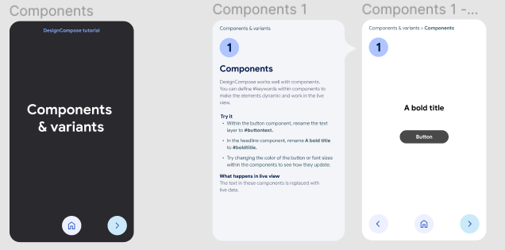
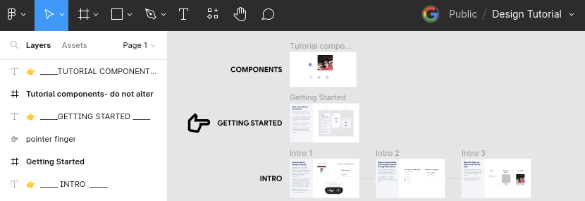
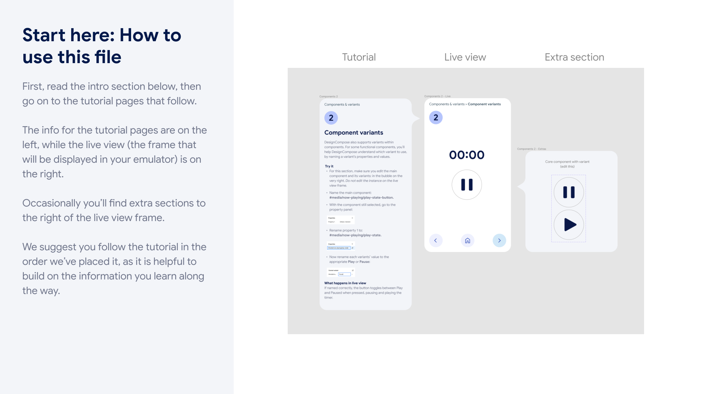



# DesignCompose Tutorial App



This page explains how to download and configure the DesignCompose tutorial app.
This is written as a tutorial, so it's important to follow each step.

## About this tutorial {#about}

The DesignCompose tutorial app shows you the capabilities of DesignCompose
through a series of interactive examples. You need a Figma account to run the
tutorial and a large-screen device to run it on.

**Note:** The tutorial uses Live Update, which reads your Figma file through
Figma's REST API. Figma limits how often that API can be called based on your
plan and seat. On a free (Starter) plan, file requests are limited to a small
number **per month**, which Live Update uses up within the first minute. After
that, Figma returns `429 Too Many Requests` until the limit resets. To follow
the tutorial with live edits, use a Full or Dev seat on a paid Figma plan. See
[Figma API rate limits][7] for details. Without a paid plan, you can still run
the tutorial app using its bundled design; see
[Run the tutorial without Live Update](#RunWithoutLiveUpdate).

## Initial setup {#InitialSetup}

1.  Acquire an Android-powered device or emulator with a large,
    portrait-orientation screen. If you don't have a physical device handy then
    you can use a virtual device (Android emulator) in Android Studio. We
    recommend a Nexus 10 device (in the Tablet category), running the Android
    Tiramisu (API 33) system image with the startup orientation set to Portrait.

    

    **Figure 1.** Android Studio virtual device definition screen.

1.  The Tutorial Android App is built from source. Follow the instructions in
    [Getting Started][1] to download the source and install the required
    development tools.

1.  The tutorial uses the Live Update feature to synchronize with your Figma
    files. Follow the instructions in [Set Up Figma Authentication][2] to create
    a Figma authentication token and be ready to use it.

## Create your copy of the Figma tutorial file {#CopyTutorialFile}

The tutorial app demonstrates how you can modify a Figma design and see the
results in your running Android app. First, create your own copy of the file to
work with:

1.  Go to the [published Tutorial design file][3]{:.external} and if necessary,
    log in to your Figma account.

1.  Click **Open in Figma** to create your own copy of the file.

1.  Wait for your copy of the file to open, then note the **Figma Document ID**
    in the URL between `design/` and the name of the document.

    For example, the **ID** of the document at
    `https://www.figma.com/design/aabbccdd/Tutorial` is `aabbccdd`.

## Launch and configure the tutorial {#LaunchTutorial}

1.  The Tutorial app's project is located in the `reference-apps/tutorial` directory. Open that directory in Android Studio and allow the project to synchronize.

1.  Build and launch the tutorial app on your device. See the 
    [Android Studio documentation][4] or manually using Gradle.

1.  Set your Figma access token in the app by running the `setFigmaTokenDebug` Gradle task.

    *   The task reads the token from the `$FIGMA_ACCESS_TOKEN` environment
        variable that was set in [Store Your Figma Access Token][5].

    *   Alternatively, you can set the token in one command by running:

    ```shell
    # From within the reference-apps/tutorial directory
    FIGMA_ACCESS_TOKEN=<YOUR_ACCESS_TOKEN> ./gradlew setFigmaTokenDebug
    ```

1.  Use the Design Switcher to load your version of the tutorial file.

    *   Click the drop-down arrow in the upper right corner of the tutorial app
    to open the Live Update Design Switcher panel. It should display *Design
        Switcher Online* if your key was set correctly in the previous step.

    ![Dropdown arrow][6]{:.screenshot}

    **Figure 3.** The Design Switcher settings button.

    *   Click the **Change** button to switch document IDs, entering the ID for
    your copy of the Figma tutorial file .

    *   Click **Load**. It takes about 10 seconds to do the initial sync.

While that's loading, return to your copy of the tutorial file on Figma and find
the Getting Started box.



**Figure 4.** The location of the tutorial Figma file's Getting Started frame.

Zoom in and begin your tutorial!



**Figure 5.** The Getting Started frame.

## Troubleshooting: `429 Too Many Requests` {#Troubleshooting429}

If the app shows nothing (or only briefly shows a list) and logcat contains an
error like this, Figma is rate-limiting your account:

```
dc_jni::error_map: Network Error: DC_figma_import Error: HTTP Error: HTTP status client error (429 Too Many Requests) for url (https://api.figma.com/v1/files/<DOC_ID>?depth=1)
```

This is most common on free (Starter) Figma plans. See
[Figma account rate limits][8] to confirm the cause and for options.

## Run the tutorial without Live Update {#RunWithoutLiveUpdate}

The tutorial app ships with a pre-fetched copy of the original tutorial design:

```
reference-apps/tutorial/app/src/main/assets/figma/TutorialDoc_3z4xExq0INrL9vxPhj9tl7.dcf
```

DesignCompose looks up bundled designs by file name, using the pattern
`assets/figma/<DocName>_<DocId>.dcf`. When you switch to your own copy of the
file with the Design Switcher, the app looks for a file matching your copy's
ID instead. No such file exists, so when Live Update can't reach Figma, there
is nothing to display.

To run the tutorial offline with your copy's document ID:

1.  Copy the bundled file under your document ID:

    ```shell
    cd reference-apps/tutorial/app/src/main/assets/figma
    cp TutorialDoc_3z4xExq0INrL9vxPhj9tl7.dcf TutorialDoc_<YOUR_DOC_ID>.dcf
    ```

1.  Rebuild and reinstall the app.

1.  Turn off Live Update so the app stops calling the Figma API:

    ```shell
    adb shell am startservice -n "com.android.designcompose.tutorial/com.android.designcompose.ApiKeyService" -a enableLiveUpdate --ez Enabled false
    ```

The app shows the tutorial design as it was published. Edits you make in Figma
won't appear until Live Update is working again. For more options, see
[Running Offline][9].

[1]: 
[2]: 
[3]: https://www.figma.com/community/file/1228110686419863535/Tutorial-for-Automotive-Design-for-Compose
[4]: https://developer.android.com/studio/run
[5]: #StoreFigmaToken
[6]: ./LiveUpdateDropdown.png
[7]: https://developers.figma.com/docs/rest-api/rate-limits/
[8]: #FigmaAccountLimits
[9]: 
