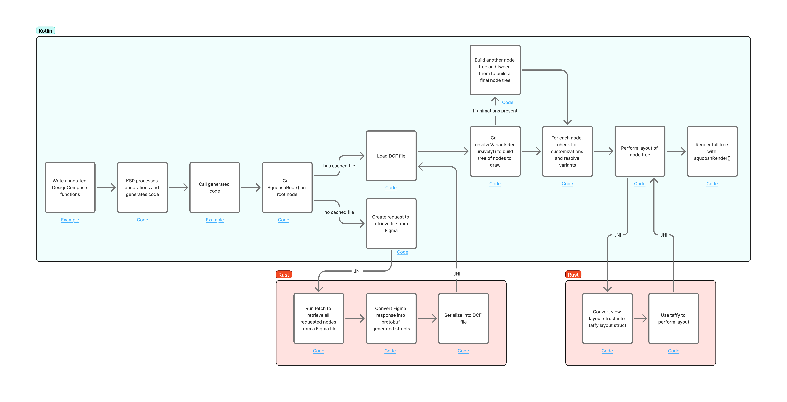

# Automotive Design for Compose

Automotive Design for Compose (also called DesignCompose in the source) is an
extension to [Jetpack Compose](https://developer.android.com/jetpack/compose) that allows every screen,
component, and overlay of your Android App to be defined in
[Figma](https://www.figma.com){:.external}, and lets you see the latest changes
to your Figma design in your app, immediately!

To use Automotive Design for Compose in an app, a developer specifies the
Composables that they'd like to be defined by Figma, and a designer uses Figma
to draw them. Most Figma features, including Auto Layout, Interactions,
Variants, and Blend Modes are fully supported. This repo includes the
DesignCompose library, an interactive tutorial app (in reference-apps/Tutorial),
and a sample customizable Media Center for Android Automotive OS (in
reference-apps/aaos-unbundled).

## Impact on the design development flow {#impact}

A primary goal of DesignCompose is to improve the design and development of user
interfaces. With DesignCompose, you can incorporate testing, corrections, and
even large-scale changes into any part of the development process.

Typically, an OEM UI development process is linear. Product managers and
designers start by defining functionality and creating UI mockups. Then
engineers implement UI mockups. At this point, an engineer implements and tests
the UI in a car. However, since testing occurs late in the development cycle,
it's difficult and costly to make changes.

DesignCompose lets you incorporate design tools into the UI development cycle to
create and visualize designs in real time.

1.  Enables development of all aspects of a UI across apps and display modes.

1.  Provides tools to create customized UI experiences for vehicles. Support new
    brands without writing new code.

1.  Allows rapid and regular software updates across a fleet of vehicles, for
    all brands and configurations, including UIs with different interaction
    models.

1.  Enables development teams to revise designs late in the software-development
    cycle. Teams can test designs in vehicles, immediately after each UI change.

DesignCompose allows teams to develop iterative and non-linear development
workflows. The following are some example workflows and use cases.

1.  When new functionality is first exposed, these tasks must be completed:

    *   Product managers and designers start by defining functionality and then
    creating UI designs in Figma (including UI navigation and interactions)
        using the built-in prototyping and Interactive Components capabilities.

    *   Engineers use DesignCompose to create Jetpack Compose components from
        the Figma design, defining "#keywords" that are used by the Figma
        document to express where data is to be displayed.

    *   Designers can continue to iterate on their Figma documents until the
        design is complete and agreed upon.

    *   Design artifacts can be built into the target app for deployment to
        production.

1.  When creating new designs for additional brands and display configurations,
    designers can create new designs in Figma, using the `#keywords` already
    defined.

## DesignCompose Architecture
Below is an architectural diagram of DesignCompose. Click the image to access a PDF of the diagram with links to the code.

